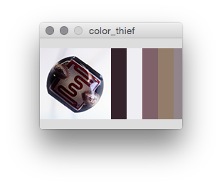

color_thief
===========
in Processing.  

  

------

###How to compile the class?

Use these commands:  

    javac de/androidpit/colorthief/ColorThief.java

Create the .jar:  

    jar cfm ColorThief.jar de/androidpit/colorthief/Manifest.txt de/androidpit/colorthief/ColorThief.class de/androidpit/colorthief/MMCQ.class de/androidpit/colorthief/MMCQ\$1.class de/androidpit/colorthief/MMCQ\$2.class de/androidpit/colorthief/MMCQ\$CMap.class de/androidpit/colorthief/MMCQ\$VBox.class

###Links:

[SvenWoltmann/color-thief-java · GitHub](https://github.com/SvenWoltmann/color-thief-java)

[PImage to BufferedImage - Processing Forum](http://forum.processing.org/one/topic/pimage-to-bufferedimage.html)

Credits and license

###Thanks

Lokesh Dhakar - for the original Color Thief JavaScript version, available at [http://lokeshdhakar.com/projects/color-thief/](http://lokeshdhakar.com/projects/color-thief/)
License

##Licensed

under the Creative Commons Attribution 2.5 License  

Free for use in both personal and commercial projects.
Attribution requires leaving author name, author homepage link, and the license info intact.