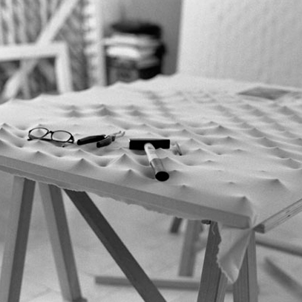
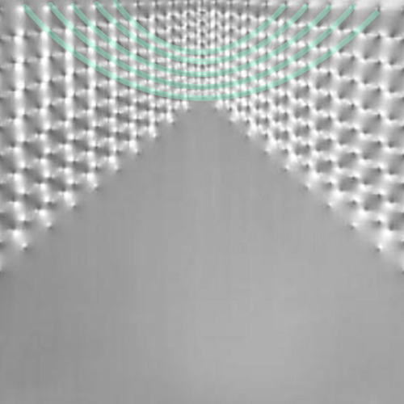

--- 
authors: 
  - "Jeanette Knipp"
  - "Natalie Schreiber"
authors-url: 
  - "https://github.com/lellahahaha"
  - "https://github.com/natascher"
elayout: project
title: "Deconstructing Master Artists - Enrico Castellani"
type: project
---

 

# Deconstructing Master Artists

The center of this seminar was engaged by the laws of design - to collect them, to analyze them and to use code to create demonstrating or even complementing examples. Those laws are often used by artists and designers; they make their work seempurposely and not haphazardly. The laws of design take advantage of visual phenomenons and the laws of physics whereby they fascinate the observer consciously or unknowingly. Then again, it can be interesting to break those laws - if you know enough about them. So what is there to unvail regarding the creations of famous, mostly vanguard artists? Arbitrariness or calculus? It is time to disassemble the great creative minds.

## Enrico Castellani

 

Enrico Castellani (*1930) is a highly noted modern italian artist. In his conversant works he especially occupies the „colour“ white through distinguishing her absence. His technique is to pull and stretch the canvas using nails to create a landscape of light and shadow where there is still only white. Depending on the location of the observer, the canvas creates illusions and always appears differently.
.In the 50s, he exposed his work on a touring exhibition oft he ZERO arts collective which was founded by Heinz Mack and Otto Piene in 1958 in Düsseldorf. The contributing artists did not see art as something flat and sacred that had to live through colour, but rather as something three dimensional which focused on its materials, its environment and its surrounding or self-induced angles. In this connection, optical illusions influenced a majority of the creations.

  

Enrico Castellani’s work is special because is very different from the typical illusive two dimensional black-and-white pictures that soon evoke headaches while watching. Contrariwise, Castellani’s works offer real depht, they create lines, areas, even patterns and only show low contrasts between colours. They open complete rooms where there is actually only canvas, nails, light and shadow, arranged perfectly by invisible laws.

 

### Castellani’s laws of design

The most frequently disposed laws of design in Castellani’s works are *the law of closure, law of proximity and the law of space through shadows*.

***Law of Closure***

 
 

The shown objects (in this case, the „dots“ of the nails and furthermore the play of light and shadow) visually create closed shapes. In this example, you should be able to see a square where there actually is none.

***Law of Proximity***

 

Similar objects that are close to each other appear as a unit, devided from other units by space or by differently shaped objects.

***Law of Space through Shadows***

 

The location of the shown objects and their colours (the light and shadow in this image) produce the impression of space or even an entire three dimensional room within an (almost) flat surface.

But there are even more laws of design that deploy their effects in Castellani’s works:

***Law of Continuity***

 

Lines, curves, simple forms or familiar shapes can still effortlessly be distinguished although they are interrupted at some points as long as the majority of the illustrated object is traced continuously. 

***Law of Space through Angles***

 
 

The free space between two or more objects can evoke the impression of three-dimensionality depending on the angle between the objects.

***Law of foreshortening***

 

If similar objects are being lined up and contracted towards one side, this appears optically as a crushed movement.

------

We tried to express the laws used by Castellani in code to create generative art. This is the result:

In concliusion, even though Castellani's work is "only" higher and lower placed nails on an evenly colored surface it's very hard to imitate using code. The nails use light and give shadow to appear as dots, lines and whole forms in a three dimensional space which is, for p5.js-beginners, a great task to authentically simulate - only having the knowledge to use basic shapes like circles and connected lines and consistent colors. Maybe gradients would have been more efffective in showing what light and shadow does to darker spots.
But still, even though our attempt to create something similar to Castellani's work has turned out less convincing, it still demonstrates the laws of design used in Castellani's Superficie Bianca.
