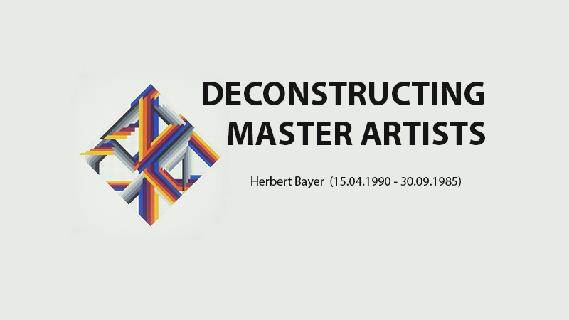
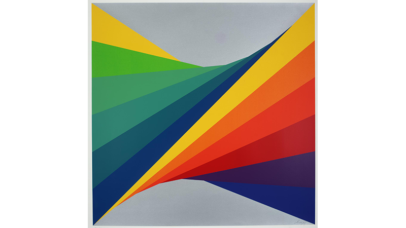
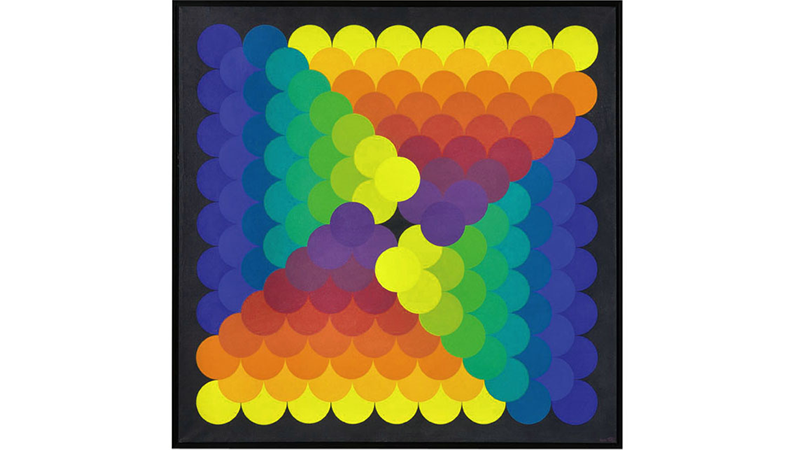

--- 
authors: 
  - "Filip Czekajlo"
authors-url: 
  - "https://github.com/filipczekajlo"
layout: project
title: "Herbert Bayer - deconstructing master artists"
type: project
authors:
  - "Filip Czekajlo"  
---
## Deconstructing Master Artists

## The Task
The task was to choose an artist/designer and analyse their art style in order to find recurring rules and variables which then needed to be recreated in Javascript using P5. The idea was to create a script which outputs generative art pieces resembling the artists art style.

## Herbert Bayer (15.04.1900 - 30.09.1985)
Herbert Bayer is 

## Art/Design Career
His art career began as he started an education in an art industry atelier specialising in architecture. After that he studied in the Weimar Bauhaus (1921 - 1925) in which he was eduacted by some very popular artists like Johannes Itten, Paul Klee and Wassily Kandinsky. Moving on, he became the leader of the newly formed printing and advertisement department in Bauhaus Dessau. There he made some very important decisions like introducing print-paper in DIN and popularizing lowercase letters. Those things were some fundamentally essential steps for creation of the creation of graphic design. In 1928 he left Bauhaus, moved to Berlin. By becoming Art Director for the Vogue he continued his focus on advertisement but he also took interest in photography and painting. Since 1933 he used his advertisement skills to spread Nazi propaganda.

## Analysis
Bayers has a wide variety of different types of art pieces, but his colorful, geometrical and abstract works have the most structure, hence those will be analysed in this project. 

  

-------------------------------------------

  

  
  
