---
authors:
  - Joshua Pacheco
  - Theodor Hillmann
authors-url:
  - "https://incom.org/profil/7029"
  - "http://invitrocolor.com"
layout: project
title: "Deconstructing Master Artists: Marcel Storr"
type: project
---

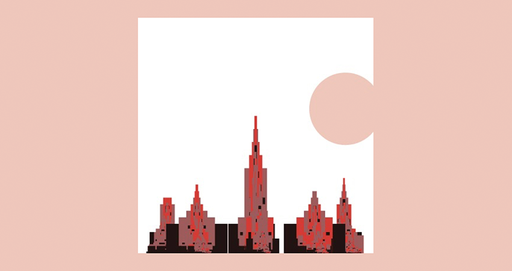

This work is part of a class at the University of Applied Sciences Potsdam. The project aims to replicate an artists work using processing code.  

The chosen artist is Marcel Storr and is supposedly categorised to Art Brut (or Outsider Art). Art Brut is a general term for autodidactic art by layman, children or people with mental disabilities. It describes an art beyond any kind of established form or movement in art.  

Marcel Storr grew up under difficult circumstances. As child he went to several protectories in which he suffered mistreatment and abuse. As an adult he worked in different jobs, married in 1964 and was employed as street sweeper in Paris. Soon Storr started to lose his hearing and to suffer from mental problems, which are not known in detail. Since 1974 he spent his life in Hôpital de Ville-Évrard, where he died of cancer.  

It appears that Storr started his artistic work very early. The first period of his creativity reaches from the beginning 1930s until the 1960s. Small and detailed, naive but realistic representations of churches predominate this period with high diligence in terms of architectonic and decorative details.  

The second period, reaching from 1964 to 1969, is abundant in large sized drawings of palace- and cathedral-like buildings. These no longer realistic, but completely imaginary, grotesquely exaggerated into sublime and monstrous architectural visions, were sketched out with a pencil, reworked with ink and finally colorised.  

End of the 1960s Storr’s wife used his absence to introduce the work to the collectors Liliane and Bertrand Kempf. She showed them his pictures, which he had hidden under the kitchen table. Since then the Kempfs traced his work even though he categorically rejected to sell his works. It lasted until 2001 until Storr’s work was shown to the public for the first time.  

## Deconstructing:  

First approaches to deconstructing Marcel Storr’s work were taken by searching for patterns in its color palette. Therefore the dominant color and the color palettes of individual art works was determined using lokeshdhakar.com/projects/color-thief. The determined RGB color values were compared within different artworks and then assigned to there place in the color circle, using color.adobe.com, to unsuccessfully look for similar patterns within his works.  

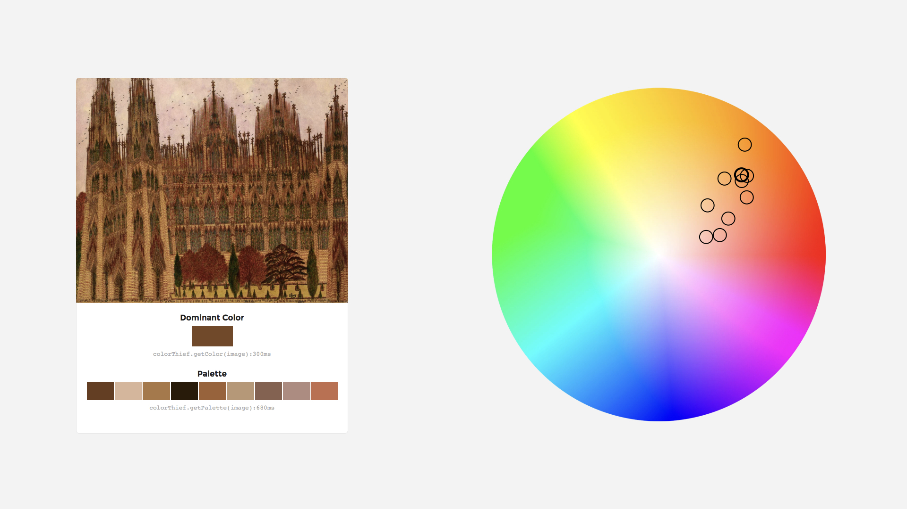

After the search for correlating colors did not come to an end, formal and structural patterns were observed: the buildings' strong upwards growing, their fractal unfolding, the noisy background and the detailed slenderness of the buildings’ components.  

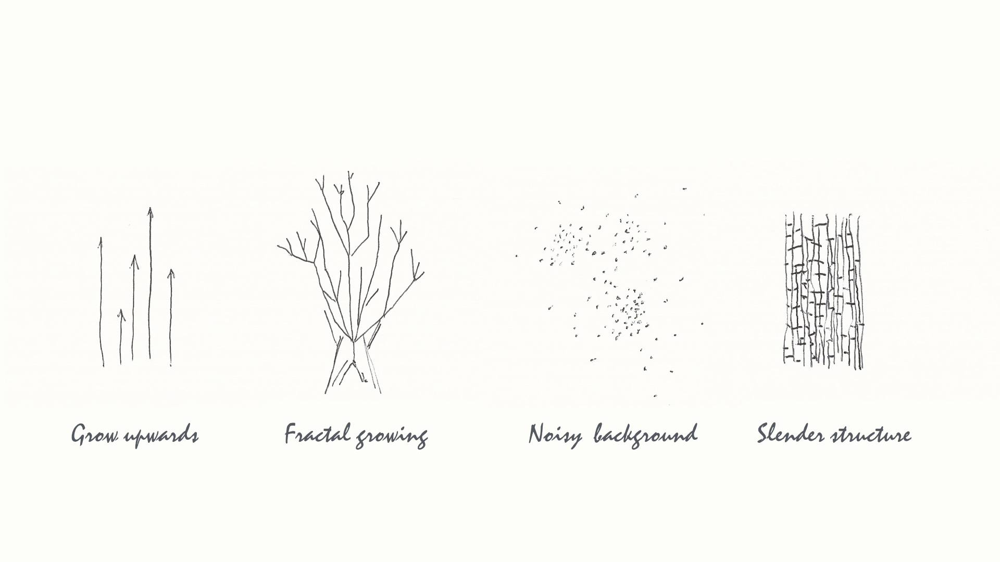  

## Reconstruction:  

The codes first iteration used the color palette of one of Storr’s pictures. The result are filled and overlaying sine curves. The second iteration aimed to imitate the pictures fractal components by multiplying the sine curves.  

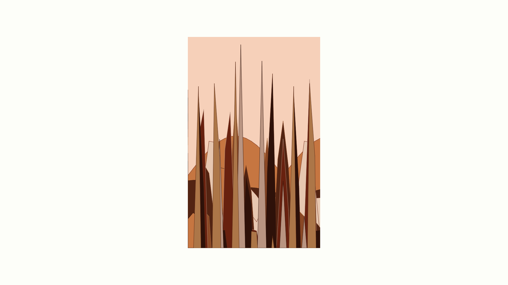
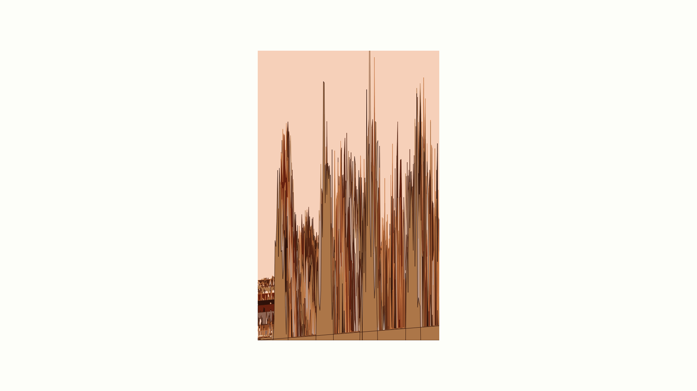

The codes third iteration was actually building small fractal „houses“. The fourth adopted the idea of fractal, growing „houses“ but replicated them in a assignable width and height. Putting several of the multiplied fractal „houses“ into one picture created the impression of one of Storr’s cathedrals.  

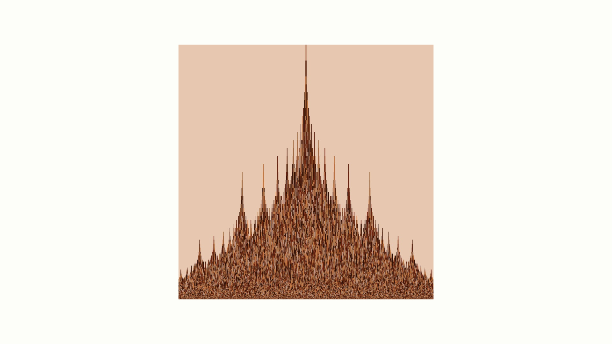
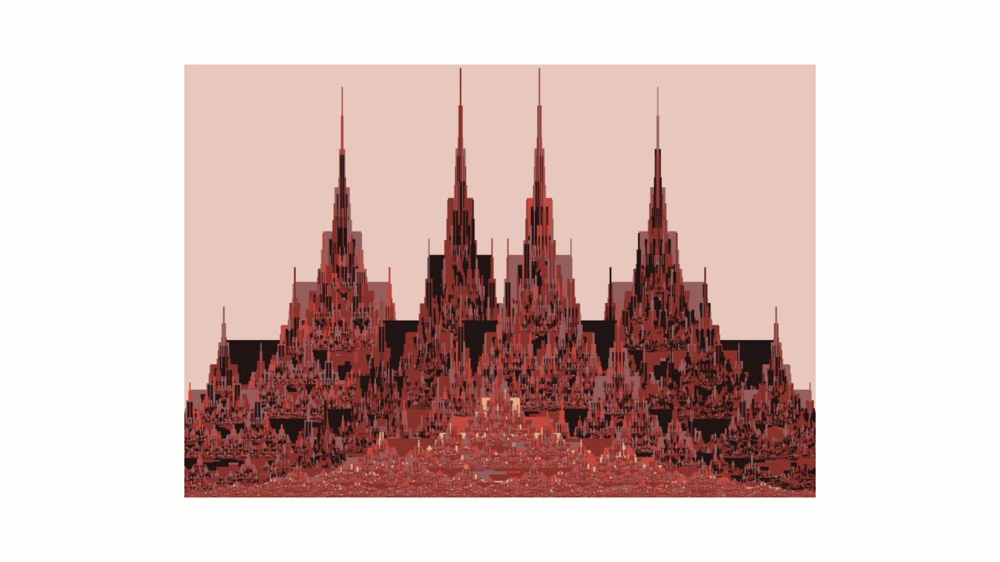

The code so far was rather static and created very similar output. In a last iteration of the code, the ouptput was much more variable, creating a new ensemble of buildings every time.

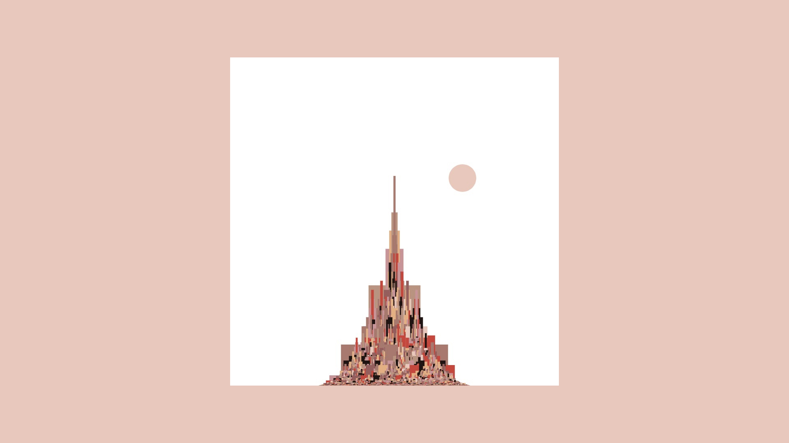
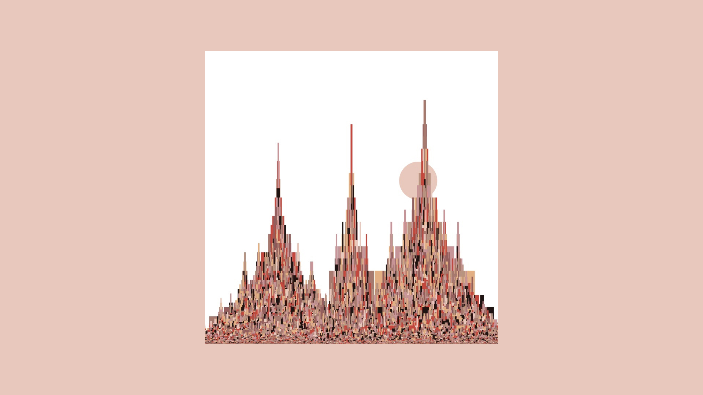
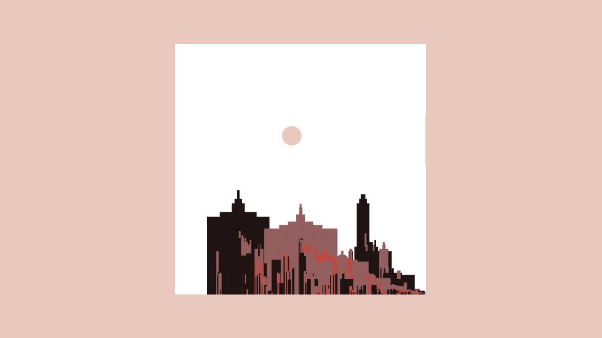
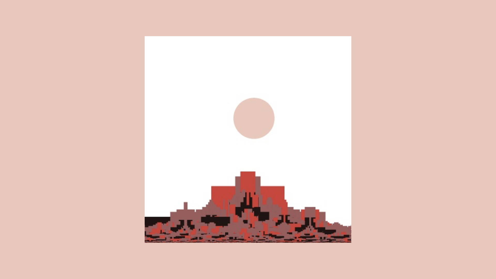

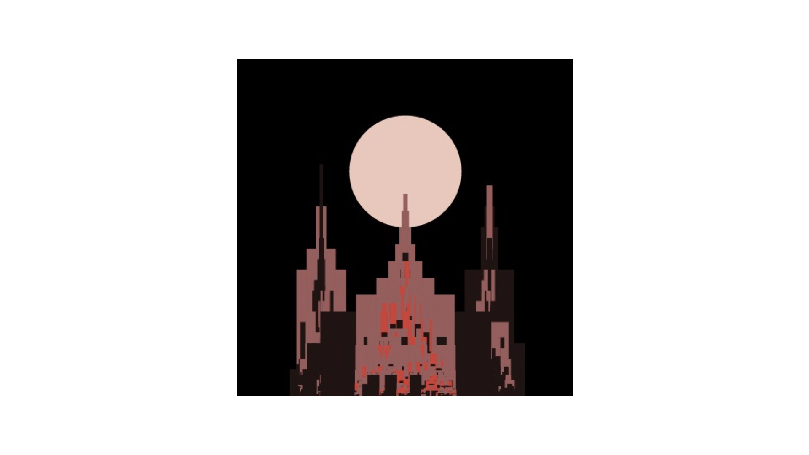

The code can be reviewed [here](https://github.com/josues/deconstructing-storr-code).
