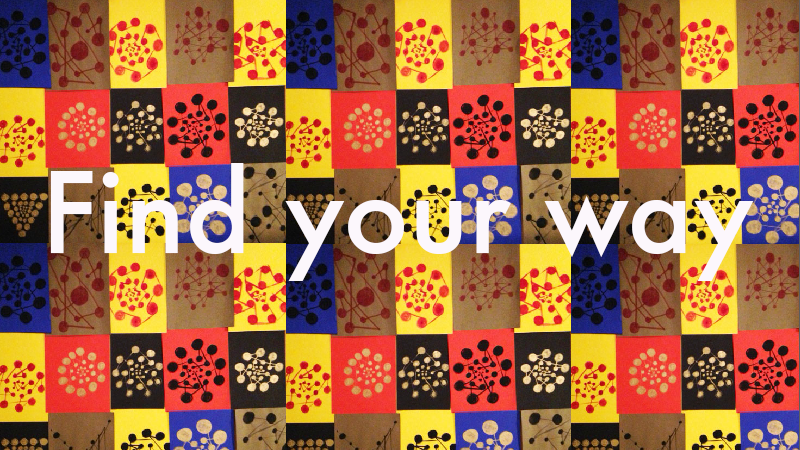
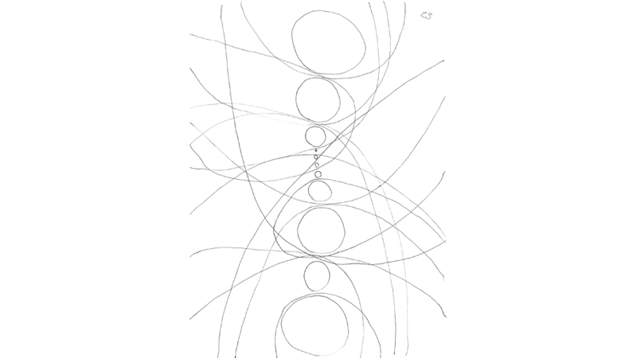
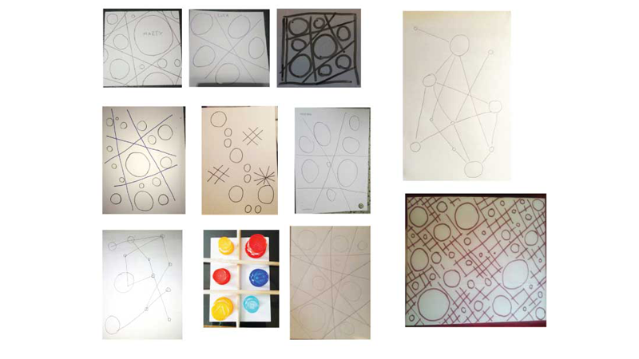
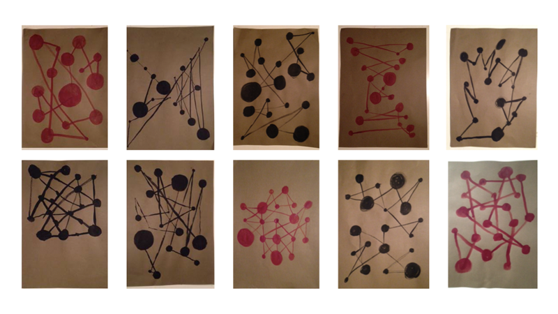
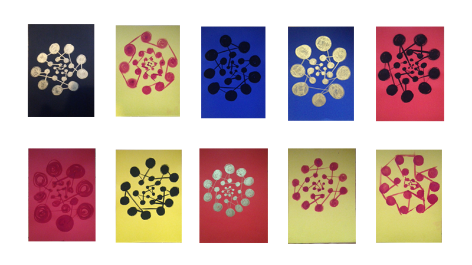
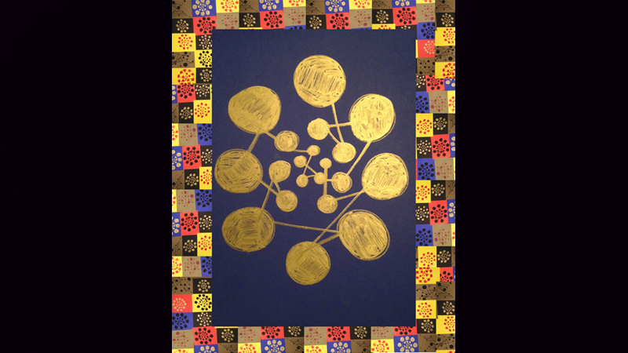

--- 
authors: 
  - "Daniele Maselli"
authors-url: 
  - "https://github.com/DanieleMaselli"
layout: project
title: Find your way 
type: project
---

The current documentation shows the results of the course “gestalten in code” in the winter semester at the university of applied science in Potsdam, supervised by Fabian Morón Zirfas. The course provides an introduction of basic programming in P5.js and Processing with a focus on gestalt psychology and a workshop on physical computing.

---

The first project of the University seminar gestalten in code was titled "analog algorithm". 
The main task of the project was to provide a set of instructions in a human language emulating algorithms in machines. The instructions had to be in one sentence, simple to understand and could be composed with parameters or constants.

## Algorithm part 1.

#### _“Draw round shapes in vertical and horizontal which differ from the diameter. Create lines that merge into different points”._ 
---

The seminar began with the task of writing the first line of an analogue algorithm. The inspiration and consequent work flow are influenced by the results from a creative class mate, as well as the comprehension for the upcoming executed algorithm and the first steps in the project implementation.

## Algorithm part 2.

#### _“Draw circles of various sizes throughout the sheet distant each other. Trace straight lines which intersect but do not touch the circles._ 

---

The second attempt for an analogue algorithm, was more accurate on the description to obtain a similar result of the previously choosen work. 

Even if the instructions to be performed have been written more clearly, most of the results were out of every expectation. The purpose wasn't to create a text that scares the reader or makes him think too much for concluding an action. For that reason it was really important to phrase the instruction clear to prevent any misunderstandings.

While looking on different drawings, it is recognizable that every person gives a different touch and express them self in different ways by just using a circle and a line. The choice of the material was free, which also included objects. 

The interesting thing about the output was set by the different visual tension giving from a circle and a line to create a grid. The problems, instaed, was to cover the entire surface for each algorithm performed.

## Algorithm part 3.

#### _Draw twenty filled circles of different sizes._
#### _Circles connect with a straight line._ 
#### _Connections must cross at least once._

---

The third part of the algorithm was set by an amount of circle to draw and a rule for crossing each line at least once. The material selected in advance was a brush and ink on rough paper. This will ensure a more controlled result at the end. 

By noting the individual result of the performers, it was immediately recognizable that it has to be more controlled by the material on which it runs. The choice was made by selecting the most suitable result of all the executed algorithm, which gave an idea for creating more visual depth and a percentage of circles, instead of a defined number of circles.

## Conclusion

#### _Draw a circle consisting of 20 to 30 filled circles that do not touch each other._ 
#### _Circles are reduced in proximity to the center._ 
#### _Create a path with a continuous straight line that connects all circles, and each line crosses an existing line and once passes through the center of each circle._

---

The third and last algorithm was the final attempt. This time it was controlled by other settings based on each performer selected. Every material where selected to combine color, according to contrast and combination. 
Each perfomer had his own setting for the execution.   

The desired results have been achieved by setting an amount of possibilities in the algorithm, like a set of number and rule that gives the final output some space and depth by reducing the sizes of the circle near the center. The text instruction where more accurate and understandable for the executor, and a wide selection to choose for the final project.

After receiving the executed algorithm from each person with different color combination, it seemed a pity not to enhance the contrast of colors. For that reason it was created a following frame with all the different received results and to enhance the design of the final selected algorithm.

---------------------------------------

## License (MIT)

(c) 2017 Daniele Maselli, University of Applied Sciences Potsdam (Germany)

Permission is hereby granted, free of charge, to any person obtaining a copy of this software and associated documentation files (the "Software"), to deal in the Software without restriction, including without limitation the rights to use, copy, modify, merge, publish, distribute, sublicense, and/or sell copies of the Software, and to permit persons to whom the Software is furnished to do so, subject to the following conditions:
The above copyright notice and this permission notice shall be included in all copies or substantial portions of the Software.
THE SOFTWARE IS PROVIDED "AS IS", WITHOUT WARRANTY OF ANY KIND, EXPRESS OR IMPLIED, INCLUDING BUT NOT LIMITED TO THE WARRANTIES OF MERCHANTABILITY, FITNESS FOR A PARTICULAR PURPOSE AND NONINFRINGEMENT. IN NO EVENT SHALL THE AUTHORS OR COPYRIGHT HOLDERS BE LIABLE FOR ANY CLAIM, DAMAGES OR OTHER LIABILITY, WHETHER IN AN ACTION OF CONTRACT, TORT OR OTHERWISE, ARISING FROM, OUT OF OR IN CONNECTION WITH THE SOFTWARE OR THE USE OR OTHER DEALINGS IN THE SOFTWARE.

See also http://www.opensource.org/licenses/mit-license.php
