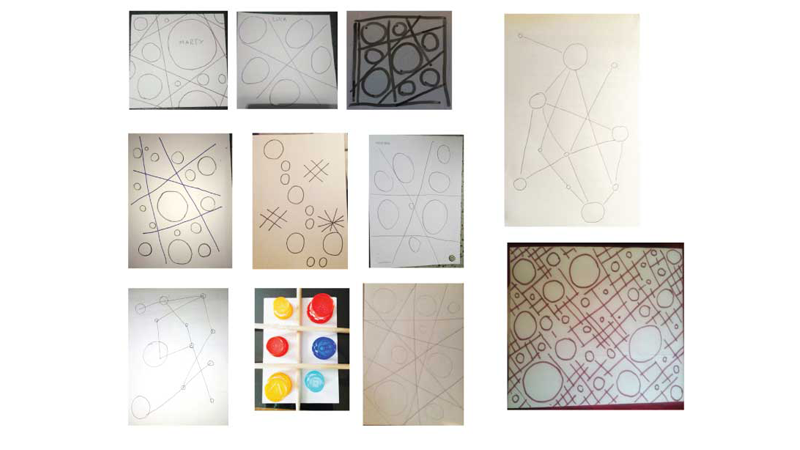
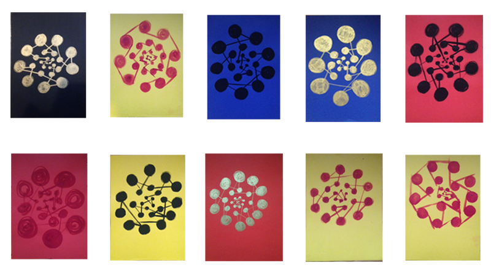
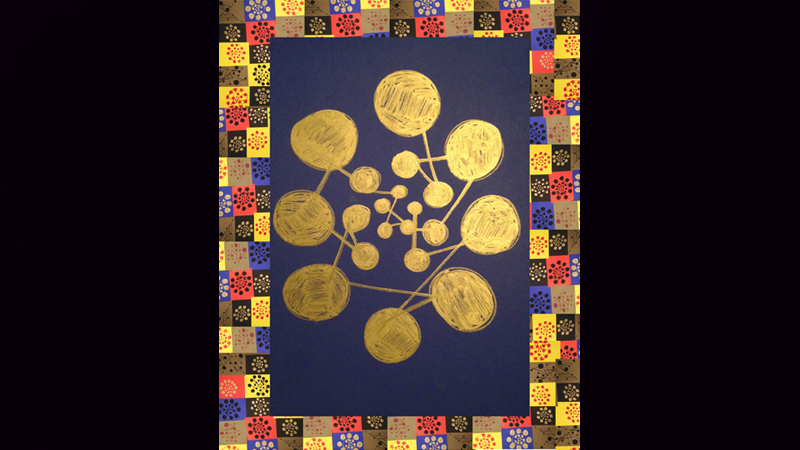

--- 
authors: 
  - "Daniele Maselli"
authors-url: 
  - "https://github.com/DanieleMaselli"
layout: project
title: Find your way 
type: project
---

The current documentation shows the results of the course “gestalten in code” in the winter semester at the university of applied science in Potsdam, supervised by Fabian Morón Zirfas. The course provides an introduction of basic programming in P5.Js and Processing with a focus on gestalt psychology and a workshop on physical computing.

---

The first project in the seminar was called analog algorithm. The main task was to provide a rule in text form that drives a person for doing a certain thing, like an algorithm for a machine but instead for a human person. Each person had to think an algorithm that has to be simple and easy to understand in words in one sentence and it has to be controlled by the person who gives the instruction, like using different material or a set of defined parameters and constants.

##Algorithm part 1.

####_“Draw round shapes in vertical and horizontal which differ from the diameter. Create lines that merge into different points”._ 
---

The first day of the seminar I wrote my first line of algorithm and found immediately a good inspiration for my upcoming algorithm and work flow thanks to a creative classmate. The output changed a lot from person to person, so I picked the one that I liked most and worked on it to create a better control and comprehension
for the upcoming executed algorithm.  

##Algorithm part 2.

####_“Draw circles of various sizes throughout the sheet distant each other. Trace straight lines which intersect but do not touch the circles._ 

---

My second attempt for an analogue algorithm was more accurate on the description. Even it was explained very well, most of the people draw something that i never though about it. I didn't wont to create a text that scares the reader or make him think too much for concluding an action. It was really important to phrase the instruction clear to prevent any misunderstandings. 

The choice of the material was free, which also included objects. I found interesting the different visual tension giving from a circle and a line to create some sort of grid. While looking on different drawings, we can recognize that every person gives a different touch and express them self in different way by just using a circle and a line. The problems for creating my expectation for this work, was more on getting the people covering the whole paper. 

##Algorithm part 3.

####_Draw twenty filled circles of different sizes._
####_Circles connect with a straight line._ 
####_Connections must cross at least once._

---

The third part of my algorithm was set by an amount of circle to draw and a rule for crossing each lines at least once. The material used was selected in advance to create a more controlled result. The performers had available a brush and ink on rough paper. After getting all the results, I choose some of my favorite drawings and recognize that I had to take more and more in the hands of the algorithm and the material on which it runs. 

I choose one specific draw, which gave me the idea for creating more visual depth and a percentage of circles, instead of a defined number of circle.  

##Conclusion

####_Draw a circle consisting of 20 to 30 filled circles that do not touch each other._ 
####_Circles are reduced in proximity to the center._ 
####_Create a path with a continuous straight line that connects all circles, and each line crosses an existing line and once passes through the center of each circle._

---

The third and last algorithm was my final attempt. This time I took more control about the drawings, with different colors according to contrast and combination. The text was more accurate and understandable for the executor. I've got the results that I desired by setting an amount of possibilities in the algorithm, like a set of number and rule that gives the final output some space and depth by reducing the sizes of the circle near the center. 

After all the drawings that I got from every person, I was inspired for making a composition with all the different results that I got from, so I used my second choice drawings to create a frame for my end results and to enhance the design. 

---------------------------------------

## License (MIT)

(c) 2017 Daniele Maselli, University of Applied Sciences Potsdam (Germany)

Permission is hereby granted, free of charge, to any person obtaining a copy of this software and associated documentation files (the "Software"), to deal in the Software without restriction, including without limitation the rights to use, copy, modify, merge, publish, distribute, sublicense, and/or sell copies of the Software, and to permit persons to whom the Software is furnished to do so, subject to the following conditions:
The above copyright notice and this permission notice shall be included in all copies or substantial portions of the Software.
THE SOFTWARE IS PROVIDED "AS IS", WITHOUT WARRANTY OF ANY KIND, EXPRESS OR IMPLIED, INCLUDING BUT NOT LIMITED TO THE WARRANTIES OF MERCHANTABILITY, FITNESS FOR A PARTICULAR PURPOSE AND NONINFRINGEMENT. IN NO EVENT SHALL THE AUTHORS OR COPYRIGHT HOLDERS BE LIABLE FOR ANY CLAIM, DAMAGES OR OTHER LIABILITY, WHETHER IN AN ACTION OF CONTRACT, TORT OR OTHERWISE, ARISING FROM, OUT OF OR IN CONNECTION WITH THE SOFTWARE OR THE USE OR OTHER DEALINGS IN THE SOFTWARE.

See also http://www.opensource.org/licenses/mit-license.php
