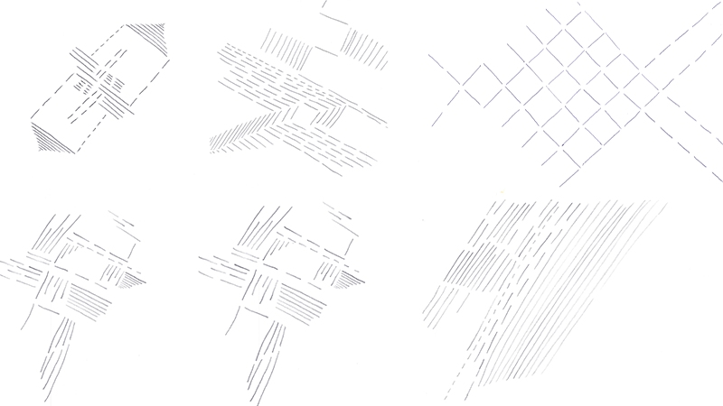
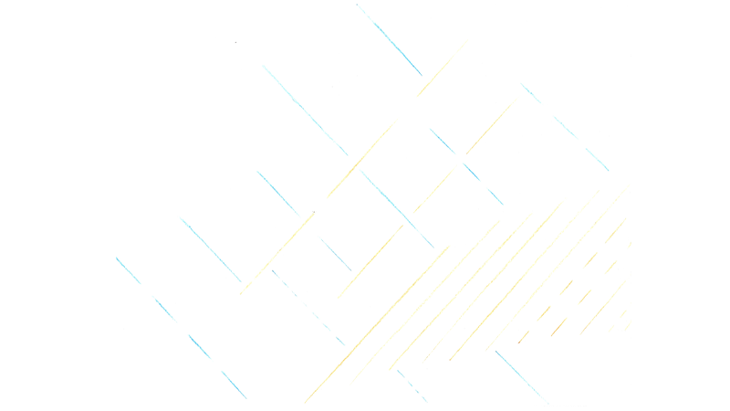
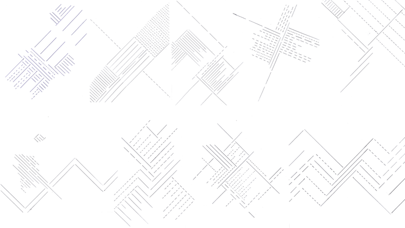

--- 
authors: 
  - "Filip Czekajlo"
authors-url: 
  - "https://github.com/filipczekajlo"
layout: Project
title: "Fractal Lines"
type: Project
authors:
  - "Filip Czekajlo"  
---

## The Task

The Task is to create an algorithm in german which is executed by humans and outputs generative art. The goal is to get aesthetic and similar results from different participants.

## First Algorithm

The first algorithm is very simple. It barely consists of three rules.

* only straight, non touching lines
* Same distance to each other (vertical and horizontal)
* Some may have regular ocurring spaces

Given those simple rules, the results don't look as promising. Words like "may" should not be used, since they might skew the end result. There need to be more definit rules.

## Second Algorithm

The second algorithm is a little bit more advanced. More rules have been added, and choices have been limited.

* At least 15 only straight, non touching lines
* Only two types of lines: at least seven 135° lines and at least seven 45° lines
* At least five must have regular ocurring spaces
* Same distance to each other (vertical and horizontal)

The results are much more consistent in this one then in the first. They all follow the same rules, yet they all look different to each other. Even though there is a huge step up from the first attempt there is still room for improvement. Since there are no hardware requirements given, most participants don't use a ruler thus leading to an untidy result. There also needs to be more experimentation done. 

## Third Algorithm

The third algorithm uses the same basic rules as the previous ones but it also adresses their problems by setting hardware requirements and using colors to get different results.

* only straight, non touching lines
* Only two types of lines: at least seven 135° lines and at least seven 45° lines
* At least five must have regular ocurring spaces
* Same distance to each other (vertical and horizontal)
* Ruler must be used to draw the lines

Because of the bright crayon colors and size limitations the end results can't be shown on this site. Pictures in full resolutions can be found [here](https://postimg.org/gallery/if0is1lq/)

Since most participants use thick crayons the colorful results tend to look childish. The thin, black and filigran lines with short spaces from the results before look much more and professional. However a ruler definitely must be used in the next test.

## Fourth Algorithm

The fourth algorithm takes all functioning rules from before, but instead of the colorful crayons it requires a black or blue pen, and sets rules for the size and occurenece of spaces in lines.

* only straight, non touching lines
* Only two types of lines: at least ten 135° lines and at least ten 45° lines
* At least seven must have regular ocurring spaces, that are not bigger then 5mm
* Same distance to each other, that can't be larger then 1cm (vertical and horizontal)
* Ruler must be used to draw the lines
* Only black or blue pens must be used

The end results look by far the best from all experiments. They all look clean, minimalistic with consistent results but they all have something unique to them.

---------------------------------

License (MIT)

(c) 2017 Filip Czekajlo, University of Applied Sciences Potsdam (Germany)

Permission is hereby granted, free of charge, to any person obtaining a copy of this software and associated documentation files (the "Software"), to deal in the Software without restriction, including without limitation the rights to use, copy, modify, merge, publish, distribute, sublicense, and/or sell copies of the Software, and to permit persons to whom the Software is furnished to do so, subject to the following conditions: The above copyright notice and this permission notice shall be included in all copies or substantial portions of the Software. THE SOFTWARE IS PROVIDED "AS IS", WITHOUT WARRANTY OF ANY KIND, EXPRESS OR IMPLIED, INCLUDING BUT NOT LIMITED TO THE WARRANTIES OF MERCHANTABILITY, FITNESS FOR A PARTICULAR PURPOSE AND NONINFRINGEMENT. IN NO EVENT SHALL THE AUTHORS OR COPYRIGHT HOLDERS BE LIABLE FOR ANY CLAIM, DAMAGES OR OTHER LIABILITY, WHETHER IN AN ACTION OF CONTRACT, TORT OR OTHERWISE, ARISING FROM, OUT OF OR IN CONNECTION WITH THE SOFTWARE OR THE USE OR OTHER DEALINGS IN THE SOFTWARE.

See also http://www.opensource.org/licenses/mit-license.php

