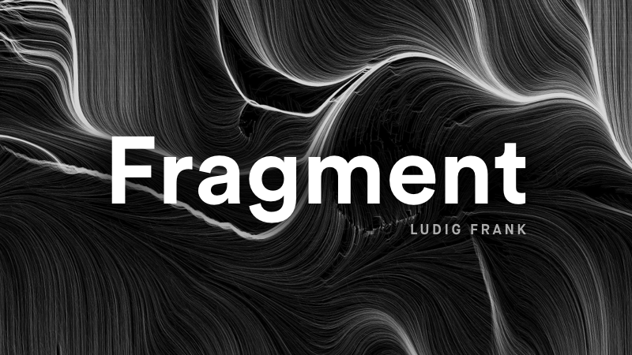
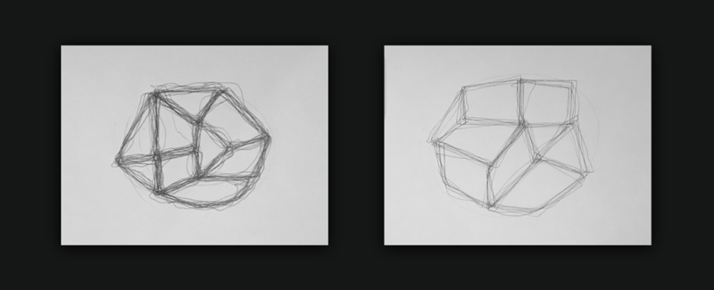
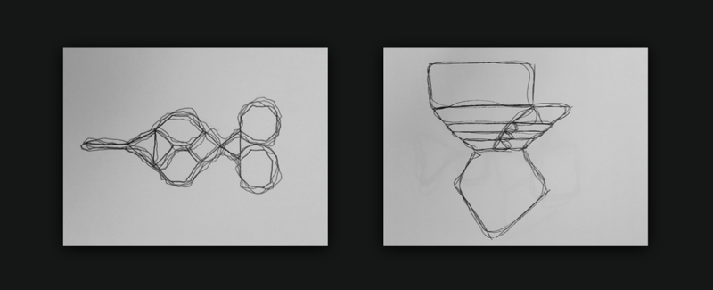

--- 
authors: 
  - "Ludwig Frank"
authors-url: 
  - "https://ludwigfrank.com"
layout: project
title: "Fragment"
type: project
---

This project is a first exploration into the generation of algorithms, with the aim to create art. Instead of a machine, these algorithms were meant to be implemented by humans. The initial instructions and further improvement circles are documented in the following. 
---------------------------------------

## The assignment
The project was the result of the first assignment of the »Gestalten in Code« course by Fabian Moron Zirfas at the University of Applied Sciences Potsdam. The objective was for the students to become acquainted with algorithms in an analog way. 

## Parameters
The concept variables and constants as used in software development was also taught through the assignment by setting them for the created algorithm.

**Variables**
- Position
- Line Width

**Constants**
- Number of Points 
- Shapes

## Iteration One
 
1. Draw 14 points on random positions on the canvas.
2. Connect these points. The resulting shapes have to become pentagons, squares or triangles. While drawing the lines, hold the pen at the topmost position.
3. Now trace the lines without taking the pen off. Do this until the pen is empty, the hand wound or you are happy with the resulting shape

The first iteration made it obvious, that the given instructions weren't accurate enough for the desired result. Especially the cohesiveness of the shape was not mentioned and thus nonexistent in most of the drawings.

## Iteration Two
 
1. Draw an ellipse in the middle of the canvas, which takes up about 40 percent of the whole area.
2. Draw 14 points with random positions on the canvas.
3. Connect the dots with Lines. Try to get an equal mix of pentagons, squares and triangles. The resulting object has to become a closed shape.

This iteration was really close to the desired outcome. However drawing a circle was a hassle for most of the participants.

## Iteration Three
 
1. Start with a line in the center of the canvas.
2. Start by extending this line by pentagons, squares and triangles with shared edges.
3. The resulting form has to be closed, centred and take up about 50% of the canvas area.
4. Trace edges of the shapes with a connected line. Avoid sharp edges and let the stroke follow the lines imprecisely (e.g by holding the pen at its end)

The final iteration removed the circle in the instructions, which was hard to draw and position in the center. 

## Conclusion
The assignment was a great introduction into creation of algorithms. Even though it seemed really mundane at some point, the iterations helped getting used to the specific instructions needed for a working algorithm later on when implemented with actual code.

## License (MIT)

(c) 2017 Ludwig Frank, University of Applied Sciences Potsdam (Germany)

Permission is hereby granted, free of charge, to any person obtaining a copy of this software and associated documentation files (the "Software"), to deal in the Software without restriction, including without limitation the rights to use, copy, modify, merge, publish, distribute, sublicense, and/or sell copies of the Software, and to permit persons to whom the Software is furnished to do so, subject to the following conditions:
The above copyright notice and this permission notice shall be included in all copies or substantial portions of the Software.
THE SOFTWARE IS PROVIDED "AS IS", WITHOUT WARRANTY OF ANY KIND, EXPRESS OR IMPLIED, INCLUDING BUT NOT LIMITED TO THE WARRANTIES OF MERCHANTABILITY, FITNESS FOR A PARTICULAR PURPOSE AND NONINFRINGEMENT. IN NO EVENT SHALL THE AUTHORS OR COPYRIGHT HOLDERS BE LIABLE FOR ANY CLAIM, DAMAGES OR OTHER LIABILITY, WHETHER IN AN ACTION OF CONTRACT, TORT OR OTHERWISE, ARISING FROM, OUT OF OR IN CONNECTION WITH THE SOFTWARE OR THE USE OR OTHER DEALINGS IN THE SOFTWARE.

See also http://www.opensource.org/licenses/mit-license.php

