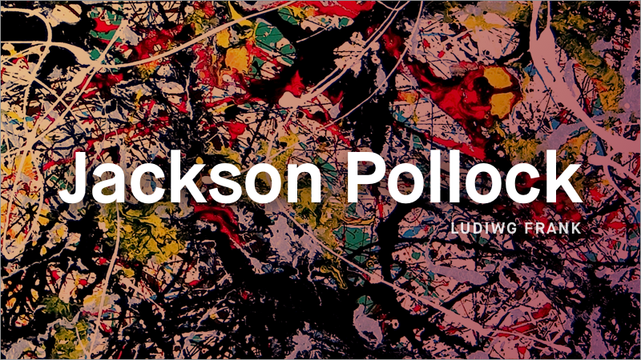
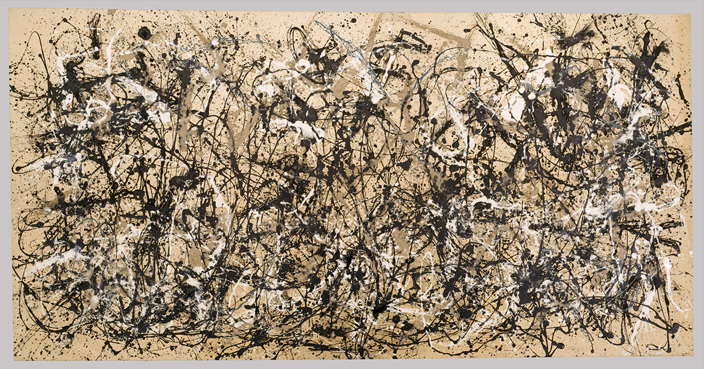
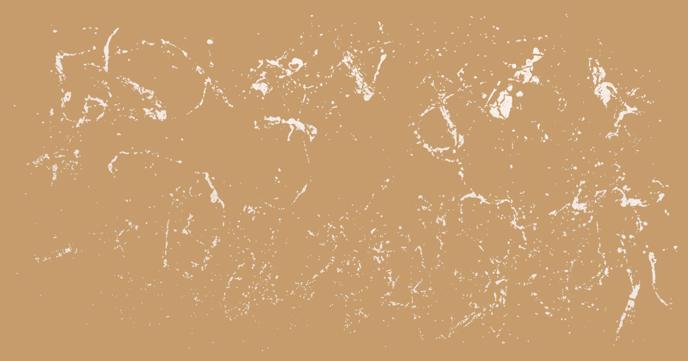
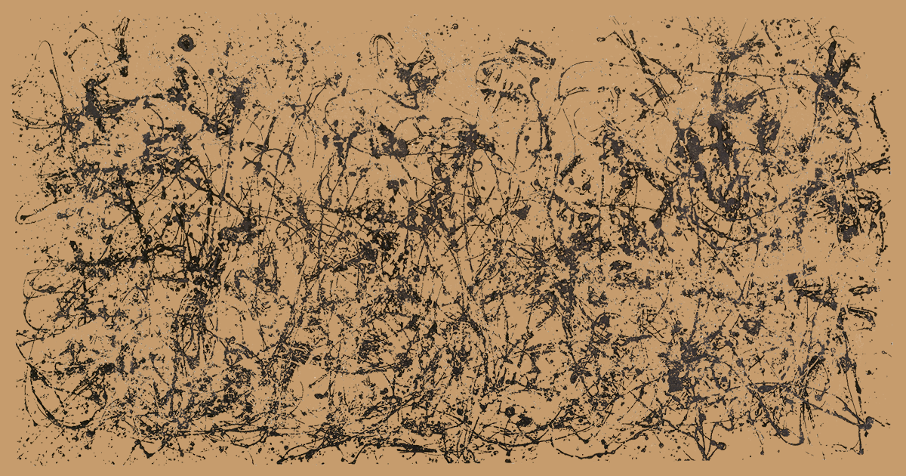
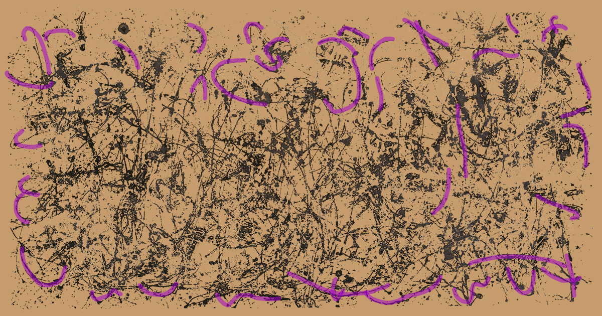

--- 
authors: 
  - "Ludwig Frank"
authors-url: 
  - "ludwigfrank.com"
layout: project
title: "Deconstructing Master Artists - Jackson Pollock"
type: project
authors:
  - "Ludwig Frank"  
---

This project is an analysis of the works of Jason Pollock and the resulting imitation with code using p5.js.

### The assignment

The first part of the task was to choose an artist and analyse his or her creative approach on their series of works or a single piece of it. In the next step the gethered information about the artists individual approach was then used to produce a generated image, resembling the work of the artist.

The assignment was part of the course "Designing with code – the basic of generative design" by Fabian Morón Zirfas at the University of Applied Sciences Potsdam.

### Jackson Pollock

Jackson Pollock was born in Cody, Wyoming, in 1912. The American was artist was one of the major representatives of the abstract expressionist movement and artist to make heavy usage of "Dripping" in his "Action Painting" works. 

### Gestalt Principles

The Gestalt psychology in the works of Pollock have caused a room for discussion in the art world since the beginning. Anton Ehrenzweig for example, who proposes the "Gestalt-free" approach as an important attack on the controlled form system in art ("Unconscious Form-Creation in Art", British Journal of Medical Psychology, no. 21). Rudolf Arnheim states that "well-organised form produces pleasure" ("Toward a Psychology of Art: Collected Essays", p.45). Suggesting that in "perception there is a tendency to the best possible equilibrium", he also dismisses the existence of Gestalt principles in Pollocks works. On the other hand, art critiques like Barbara Rose or Clement Greenberg, assign the paintings of Pollock a high degree of universal patterns and the "power to assert an paint-strewn or paint-laden surface as a single synoptic image" ("Art and Culture" - Clement Greenberg, Boston,
1961, p. 217).
The oeuvre of of Abstract Expressionists like Pollock forms a foundation for the Color Field era of the 1940s. With the necessity and will for change the post-World War II era it gave Formalism and Minimalism, which is deeply linked to the Gestalt principles, a platform to flourish.

### Nr. 30 - Autumn Rhythm

Jackson Pollocks Nr. 30 is a great example of the law of closure. The curvature of the outer strokes in most cases opens up to the middle of the image, giving the form the impression of being one object, a continuous trajectory around the seeming chaos. This chaos however, resembles "the way patterns in Nature evolve" in striking similarity ("Fractal expressionism", Richard Taylor et al., 2000).

The black trajectories give the image a coherent feeling where as the whites seem to break the unity. This demonstrates the habit of Pollock to paint with one colour only during one period of the months it took to finish a piece.

### Code

The algorithm for the recreation of Pollocks work can be found [here](https://github.com/LFra/gestalten-in-code/blob/dc45adbfb632a4f9c77abececba7c505a1cc68a1/color/p5js/dripping-wall/index.js).

---

License (MIT)

(c) 2017 Ludwig Frank, University of Applied Sciences Potsdam (Germany)

Permission is hereby granted, free of charge, to any person obtaining a copy of this software and associated documentation files (the "Software"), to deal in the Software without restriction, including without limitation the rights to use, copy, modify, merge, publish, distribute, sublicense, and/or sell copies of the Software, and to permit persons to whom the Software is furnished to do so, subject to the following conditions: The above copyright notice and this permission notice shall be included in all copies or substantial portions of the Software. THE SOFTWARE IS PROVIDED "AS IS", WITHOUT WARRANTY OF ANY KIND, EXPRESS OR IMPLIED, INCLUDING BUT NOT LIMITED TO THE WARRANTIES OF MERCHANTABILITY, FITNESS FOR A PARTICULAR PURPOSE AND NONINFRINGEMENT. IN NO EVENT SHALL THE AUTHORS OR COPYRIGHT HOLDERS BE LIABLE FOR ANY CLAIM, DAMAGES OR OTHER LIABILITY, WHETHER IN AN ACTION OF CONTRACT, TORT OR OTHERWISE, ARISING FROM, OUT OF OR IN CONNECTION WITH THE SOFTWARE OR THE USE OR OTHER DEALINGS IN THE SOFTWARE.

See also http://www.opensource.org/licenses/mit-license.php

