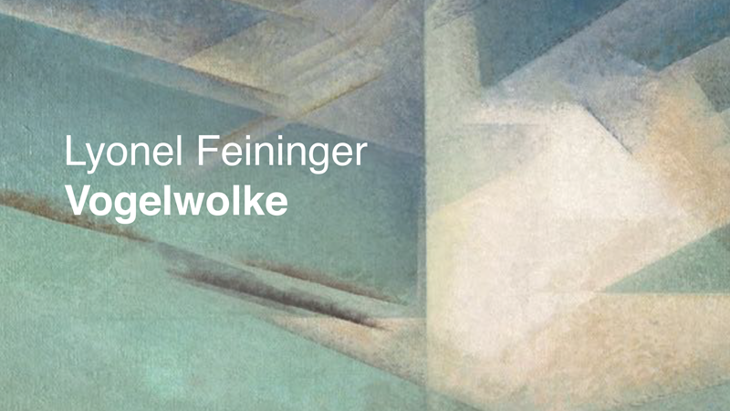
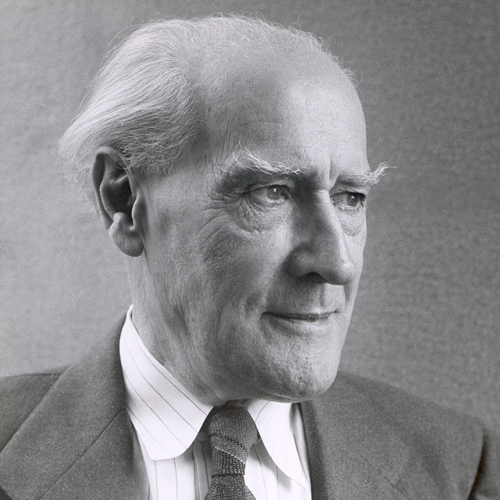
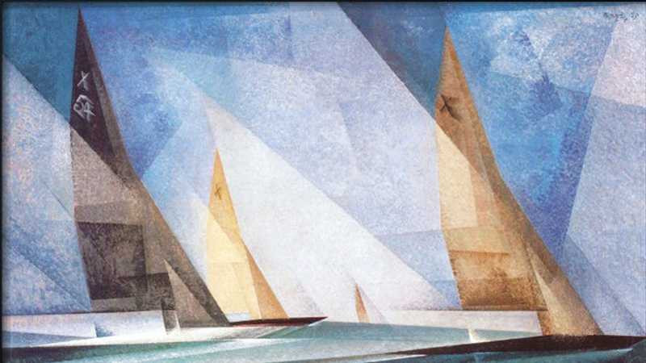
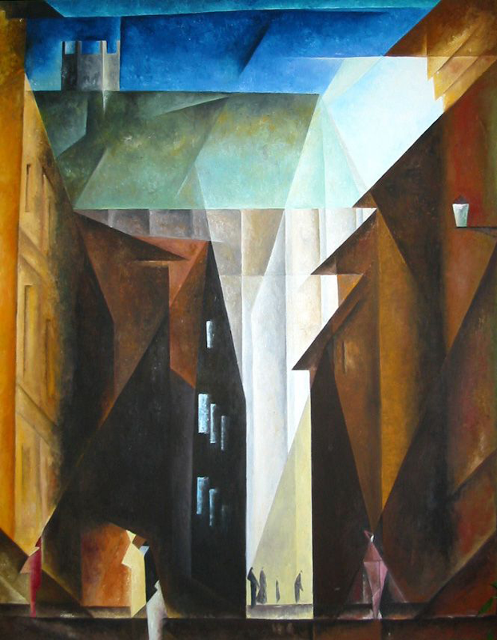
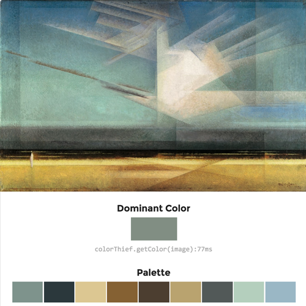
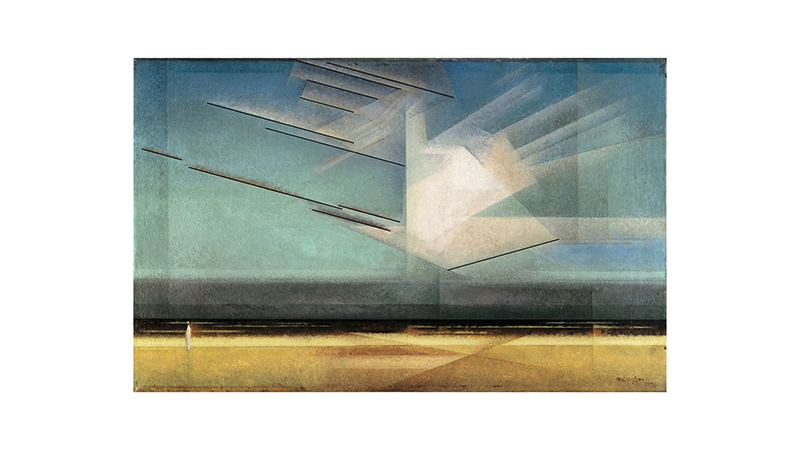
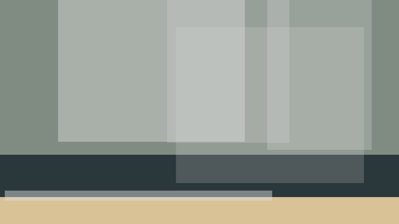
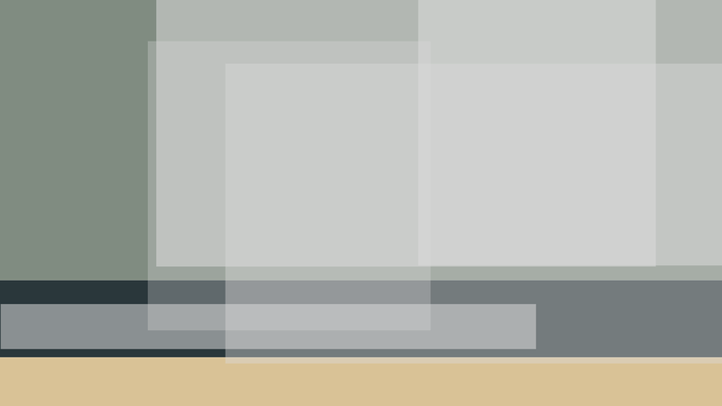

--- 
authors: 
  - "Jakob von Kietzell"
  - "Julian Broocks"
authors-url: 
  - "https://github.com/hulianbrox"
  - "https://github.com/jakobvk"
layout: project
title: "Lyonel Feininger"
type: project
---

<h1> Deconstructing Master Artists </h1>

This project is an extensive analysis of artist Lyonel Feininger's painting “Vogelwolke” from 1924. By using the gestalt laws and self-developed new methods and tools, a set of rules and regulations was developed and applied on code to create generative art based on this old existing piece of art.

The project was developed for the class “Gestalten in Code – Die Grundlagen Generativer Gestaltung” by Fabian Morón Zirfas at the University of Applied Sciences Potsdam, Faculty of Design.

<h2> Who is he? </h2>
Due to his works at Bauhaus 1919, Lyonel Feininger is one of the most eminent artist of the period of the “Classical Modernity”. 
Lyonel Feininger was born 1871 in New York City. When he came to Europe 1887 he studied in Hamburg, Berlin and then Paris, France. 1919 he was called to Bauhaus University by Walter Gropius to be the first school master for painting and graphics. 

He mostly pictured cities, gothic buildings and the sea, coastlines and sailing ships.
Being influenced by the Cubism and Orphism, he calls his style “Prismaism”. His art is famous for sceneries flooded with light, geometricization to focus on the essentials and shapes being duplicated many times. Always, intense and detailed nature studies are being made before starting a painting. A new, inner reality is being created by breaking away from the outer reality.
Lyonel Feininger once said “And it is always like that, whatever I draw – it is confirmed by nature itself.” (Lyonel Feininger, 1924) which is an interesting statement for us, as ongoing generative artists, because his paintings seem to have a very logic and regulated background, but are, concerning him, only created by nature.

<h2>“Vogelwolke” 1924 </h2>

The painting “Vogelwolke” from 1924 was drawn in the middle of Lyonel Feiningers productive years.

 

<h3>Why did we pick it?</h3>
When looking for an artist and pieces of art for this project, we enjoyed the style of Lyonel Feiningers paintings because they, on the one hand side, appear to be only abstract shapes, but on the other hand still portray nature.
We felt like it is possible to reduce the painting on a set of rules and try to recreate sth similar with code. It seemed interesting to find out about calculations Lyonel Feininger developed for his paintings.

<h2>Analysis</h2> 

Before painting the final oil painting named “Vogelwolke” in the year 1926, Lyonel Feininger made two nature studies at the coast of the Baltic Sea 1924, one with pencil, the other with watercolour. 
A cloud is moving towards a curved coastline, in the background there is mountains. The formal structure was changed for the painting 1926, where the cloud is standing and there’s no coastline, just a person standing at the beach. 

In the following the painting was analyzed by composition, size, brightness, transparency, shapes, colors and lines.

<h3>composition</h3>

Three zones
*yellow beach
*dark sea
*see-through blue sky

There is horizontal and vertical colour-shapes. The lines and shapes of the cloud and its shadow on the beach cut the three zones into smaller shapes. 
In the foreground there is a small person. 

<h3>size/ratio</h3>

[1:1:4] Beach – Sea – Sky
Or
[1:2] Earth – Sky

<h3>brightness</h3>

The middle of the cloud is the brightest point of the painting, followed by the upper part of the yellow beach. The transition between beach and sea is the darkest area as it is nearly black. The light-dark contrast, which divides the painting into its different areas is very characteristic for itself. 

<h3>transparency</h3>

Overlaying shapes with gradation of transparency from light to dark/ dark to light. The sky is lighter at the bottom than at the top, the earth is lighter at the top than at the bottom. 

<h3>Shapes</h3>

There is no clear and closed shapes. Rectangles appear as basic shapes. Some shapes sharply stand out against others, some overlay and some shine through one another. 
Open triangles with tone shading of colour merge into the background. Lyonel Feiningers style is called Prismaism. 

<h3>Farbbereich</h3>

<h3>Linien</h3>

Most of the lines are horizontal. Many lines are parallel.  

Lines in a slightly different angle that are moved up or down give an impression of movement. 

There is a cross in the sand. In combination with some vertical lines the cross gives an impression of depth.

<h2>Gestalt Laws</h2>

<h3> Law of Similarity </h3> 

The feathers of the cloud appear to belong together because the shapes show the same style of gradation of the transparency. 

<h3>Law of Space through overlapping lines </h3> 

The painting seems to be deep because of the cross in the middle of the picture in combination with vertical lines.
 

<h3>Raum  </h3>  
Warm colours seem to be close, cold colours seem to be far. The beach appears closer than the sky. 

<h3>Law of contrast </h3> 
Areas are divided through contrast. The pretty dark sea stands out from the beach. The light cloud stands out from the sky. The dark sea seperates the beach and the sky. 

<h2>Code</h2>

The code focusses on composition, sizes and shapes, as well as overlapping and transparency. 
The size of the canvas is fixed to 780x500. It is separated into three areas that are coloured in the average three main colours in the ratio 1:1:4.

Grey and white shapes in different gradation of transparencies are laying over the main three areas. The location of these shapes is fixed to a certain area. Within this area the shapes will move every time executing the code due to a random factor in size and location. The gradation of transparency varies in the range of 10-60 in the HSB colour range. 

The Output is variations of the basic shapes of Lyonel Feiningers “Vogelwolke”. 

<h2>Conclusion and future prospects</h2>

The variations of the Output of our code are similar to one another but are each providing a basis for a new individual “Vogelwolke” painting. If lines and tone shading are added according to the rules we developed, the cloud is shifting in the sky/ the upper two thirds of the picture. 

It can definitely be said that Lyonel Feininger was inspired by nature and didn’t focus much on creating an algorithm before painting. Still he somehow paid attention on the direction of lines, sizes and subdivision of the painting. It is not possible to fully transfer the “Vogelwolke” into code because most of the painting was drawn freely and randomly.

<h2>License (MIT)</h2> 

(c) 2017 Jakob von Kietzell and Julian Broocks, University of Applied Sciences Potsdam (Germany)

Permission is hereby granted, free of charge, to any person obtaining a copy of this software and associated documentation files (the "Software"), to deal in the Software without restriction, including without limitation the rights to use, copy, modify, merge, publish, distribute, sublicense, and/or sell copies of the Software, and to permit persons to whom the Software is furnished to do so, subject to the following conditions: The above copyright notice and this permission notice shall be included in all copies or substantial portions of the Software. THE SOFTWARE IS PROVIDED "AS IS", WITHOUT WARRANTY OF ANY KIND, EXPRESS OR IMPLIED, INCLUDING BUT NOT LIMITED TO THE WARRANTIES OF MERCHANTABILITY, FITNESS FOR A PARTICULAR PURPOSE AND NONINFRINGEMENT. IN NO EVENT SHALL THE AUTHORS OR COPYRIGHT HOLDERS BE LIABLE FOR ANY CLAIM, DAMAGES OR OTHER LIABILITY, WHETHER IN AN ACTION OF CONTRACT, TORT OR OTHERWISE, ARISING FROM, OUT OF OR IN CONNECTION WITH THE SOFTWARE OR THE USE OR OTHER DEALINGS IN THE SOFTWARE.

See also http://www.opensource.org/licenses/mit-license.php
