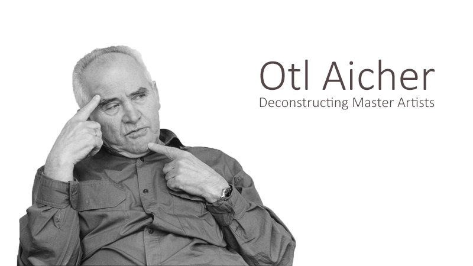
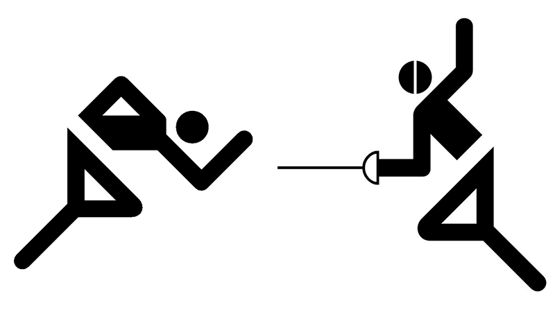
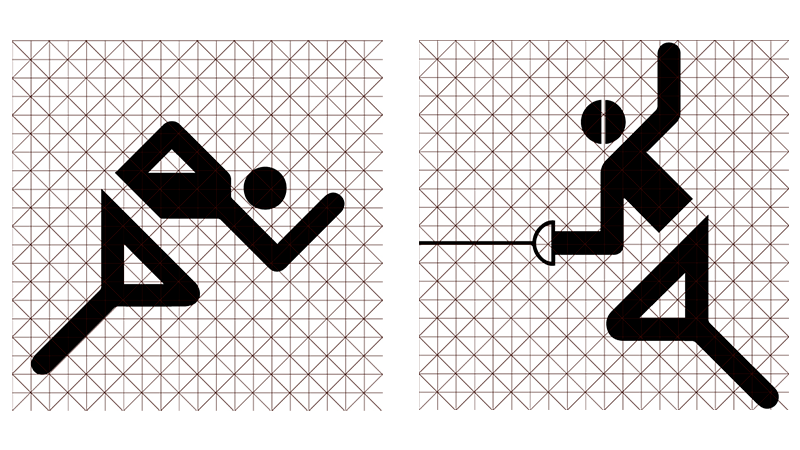
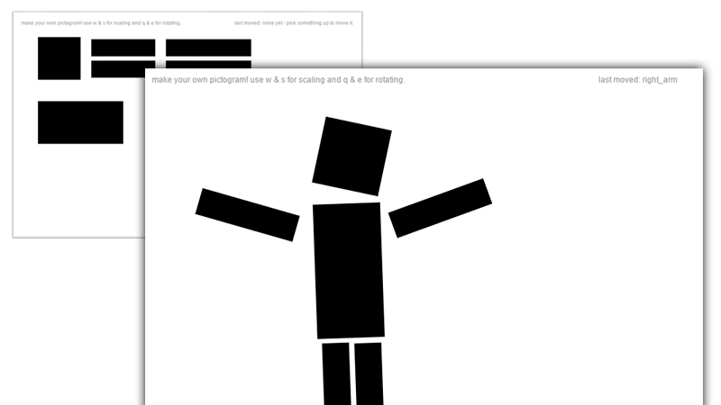

--- 
authors: 
  - "Marius Claßen"
  - "Malte Völkner"
authors-url: 
  - "https://github.com/mariusclassen"
  - "https://github.com/MalteVoelkner"
layout: project
title: "Deconstructing Master Artists: Otl Aicher"
---

## Description
The following project is an analysis of pictograms made by Otto "Otl" Aicher for the Olympic Games 1972.
The focus was on the correlation to common laws of gestalt and generative art, the main subject of the course [Gestalten in Code – Die Grundlagen Generativer Gestaltung](https://incom.org/workspace/6886) held by [Fabian Morón Zirfas](http://fabianmoronzirfas.me/) at the [University of Applied Sciences Potsdam](https://www.fh-potsdam.de/) in winter 2016/2017.

## Assignment
The assignment was an introduction into the huge subject of computer generated art. Based on a given list Otl Aicher was picked for a few reasons: Aicher's art is still popular and his pictograms are used worldwide in plenty different industries. We figured that pictograms can be easily applied to different laws of gestalt. Furthermore, the assignment included a detailed analysis of a single project or a series. The next step was to actually use a few laws of gestalt to create something new based on the found information of the analysis.

## Otto "Otl" Aicher
Before we dive into the analysis we want to give a short summary of Otl Aicher: born in 1922 in Ulm Aicher was a leading German graphic- and type designer. He was one of the founding fathers of the Hochschule für Gestaltung in Ulm, Germany and created the pictograms for the Olympic Games 1972. Another well-known project is the corporate design development of the German airline Lufthansa. In short: Aicher was part of defining the European design history.

## Analysis
For our analysis we picked the best known project of Otl Aicher: his pictograms, firstly made for the Olympic Games in 1972, later extracted into hundreds of pictograms for completely different industries. A pictogram is *an icon that conveys its meaning through its pictorial resemblance to a physical object* ([Source](https://en.wikipedia.org/wiki/Pictogram)). We picked two of the original pictograms to analyse them further: the pictogram for **athletics** as well as **fencing**.

Our focus was based on three factors: **similarities**, **differences** and **possibilities**. External similarities are a similar allocation of the body party as well as resembling proportions in all pictograms. The upper and lower body is split in every pictogram and the person is always in a dynamic posture, for example someone running or throwing something. Characteristics found in every pictogram are that they always are a symbol for the sport they are portraying. An objective analysis shows, that the pictograms are always 2D without any depth effects. The persons are filled with black and show no mimic or emotions. Based on these facts we were able to create a first guideline for creating a pictogram:

+ Black pictogram on a white background
+ Modular body with the same body parts
+ Same gap between upper and lower body
+ Only 45°/90°/135°-angles

A big insight was, that besides the above listed rules - every pictogram is different. They are not aligned on a template-grid, they do not always have the same proportion-size, they do not have the same gaps between external items (like the sword for fencing). An example for the missing grid is below.

## Insights
The founding of the analysis was not what we expected - we expected a clear and definitive guideline with which the creation of a pictogram should be easy and fast. However, we figured out that because of the world-wide spread of Aichers pictograms an easy recreation of them cannot be easy. Pictograms are too different, even though they almost always look "the same". They cover too many subjects, industries and a gigantic range of sports than they would be able to be easily fit into a small set of rules. A big part of that is that most of the pictograms need add-ons that are made for only that pictogram - for example, for fencing the sword is unique and needs to be added to make the pictogram distinct from other sports that may have the same dynamic body posture. To fit all these different objects into a guideline would be near impossible. If the pictograms would fit into named book of rules, they wouldn't be able to tell apart - but that is what they are made for, to get a fast and definitive understanding of the subject described.

## Our implementation
A part of the given assignment was to transfer the insights of the analysis into a new environment. In our project we tried to implement the guidelines into an editor written in **P5.js**. The original plan was to build an editor with pre-given objects that would allow the user to create his own pictograms in a matter of seconds. We used a library called [p5.play](http://p5play.molleindustria.org/) to realize our idea. The code can be found [here](./assets/p5.play-master.rar). This is the final interface we programmed:

## Conclusion
Analysing Otl Aichers work was a great introduction into the laws of gestalt. Taking a deeper look into an excerpt of a series provided us with a great understanding on how pictograms are made and what they need to work as intended. Our main insight was that even though pictograms look alike each is different and works with their own set of rules.

---

## License (MIT)

© 2017 • [Marius Claßen](https://github.com/mariusclassen) & [Malte Völkner](https://github.com/MalteVoelkner)

Permission is hereby granted, free of charge, to any person obtaining a copy of this software and associated documentation files (the "Software"), to deal in the Software without restriction, including without limitation the rights to use, copy, modify, merge, publish, distribute, sublicense, and/or sell copies of the Software, and to permit persons to whom the Software is furnished to do so, subject to the following conditions:

The above copyright notice and this permission notice shall be included in all copies or substantial portions of the Software.

THE SOFTWARE IS PROVIDED "AS IS", WITHOUT WARRANTY OF ANY KIND, EXPRESS OR IMPLIED, INCLUDING BUT NOT LIMITED TO THE WARRANTIES OF MERCHANTABILITY, FITNESS FOR A PARTICULAR PURPOSE AND NONINFRINGEMENT. IN NO EVENT SHALL THE AUTHORS OR COPYRIGHT HOLDERS BE LIABLE FOR ANY CLAIM, DAMAGES OR OTHER LIABILITY, WHETHER IN AN ACTION OF CONTRACT, TORT OR OTHERWISE, ARISING FROM, OUT OF OR IN CONNECTION WITH THE SOFTWARE OR THE USE OR OTHER DEALINGS IN THE SOFTWARE.

