--- 
authors: 
  - "Daniele Maselli"
  - "Denys Ivanchenko"
authors-url: 
  - "https://github.com/DanieleMaselli"
  - "https://github.com/deivanchenko"
layout: project
title: "Sol Lewitt - Geometric shapes"  
type: project
---

## Deconstructing Master Artist: Sol Lewitt 

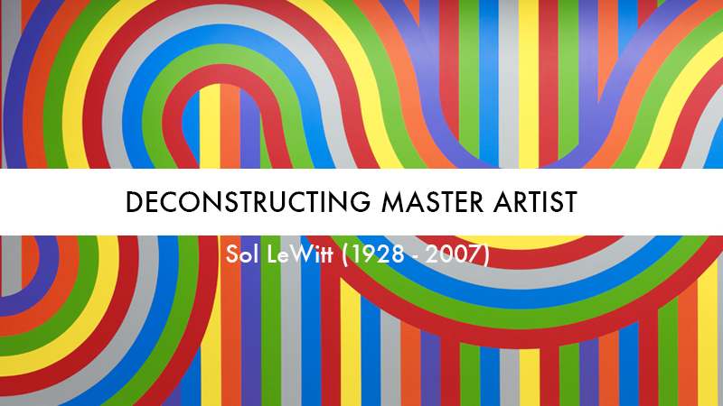

The following project shows the result of the seminar project "deconstructing master artist" at the university of applied science in Potsdam supervised by Fabian Morón Zirfas. The course provides an introduction of basic programming in P5.js and Processing with a focus on gestalt psychology and a workshop on physical computing.

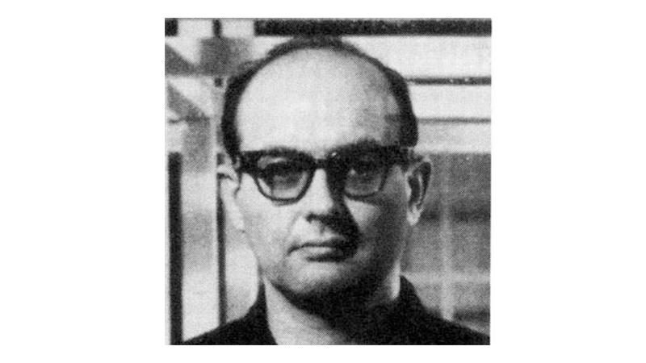

https://upload.wikimedia.org/wikipedia/en/3/36/Sol_LeWitt.jpg

## Sol LeWitt - Creation

Le Witt had a strong influence Russian avant-garde and constructivist. We can say that as an artist, Sol LeWitt came out of the "Black Square" by Malevich. Cube LeWitt called his "base unit". It then truncates the verge of turning the cube in the lattice, then multiply cubes, creating chaos.

The artist experimented with form and color of objects, working with simple geometric shapes, mostly in black and white technique. In the later stages of creativity LeWitt created the sculpture and graphic series, doing murals. His works are in major collections of contemporary art.

In the early 1960s, Sol LeWitt creates a certain amount of wall reliefs, which he calls "the wall structure." These reliefs exiting the plane of the wall space in the viewer's residence, are based on the interaction of various geometric shapes: cubes, squares, parallelepipeds and including one figure to another. Famous "modular structures" Sol LeWitt - three-dimensional lattice, built on repetition-cube module.

The American artist has won its fame thanks to the invention of complex compositions, composed of a deceptively simple geometric shapes and colors. These views Le Witt played a decisive role in the formation of new radical aesthetics of the 1960s, which completely eliminates the narrative in art. In this case, the goal of the artist is not to tell a story and evoke an emotional response from the viewer.
In his article for the magazine Artforum in 1967, Sol LeWitt gave a definition of conceptual art: "When an artist uses a conceptual form of art, it means that all the planning is done in advance, all decisions are made beforehand and the execution takes place formally, superficial, shallow ... the purpose of the artist engaged in conceptual art, - to do their job intellectually interesting for the viewer, and thus not affecting his soul. "

LeWitt infrequently created paintings. His most famous works - "Red square, white letters" - refers to 1963. Since the 1970s Levitt began working on an early graphics - screen printing. Then, in the artist's work includes in-depth engraving and later - engraving and other techniques.

## Sol Lewitt: Color Bands 
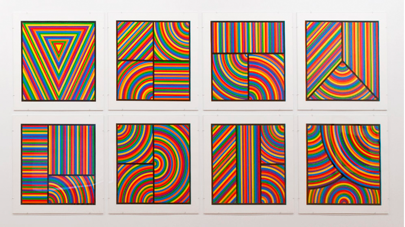
 

http://baeditions.com/sol-lewitt-artwork/sol-lewitt-color-bands.htm

Color Bands is a series of eight prints in which colored curves and lines play on the optical effects. For Color Bands, Sol lewitt composed a set of drawings and measurements that were executed by a master printmaker.

## Analyze: Geometric shapes
 
The first step was made by analyzing the studies behind the geometric shapes in his composition, and with the help of computer programs, it has been recreated two prints of his works to be then analyzed in its details. 

We develop his work without the use of color, this in order to show the purity of the geometric forms and to have a better comprehension what is behind the color. His work method is composed with simple and repeated geometric shapes that changes one to another with different combination. By taking a closure look at the geometric shapes, we realized that the origin of the forms are always coming from the same source and repeat itself throughout the canvas. The space separating each repetition is always measured by the same magnitude until arriving to its ultimate point. In most of his drawings, the separation that occurs between one geometry to another, is closed inside a black line. This in order to separate the concentration of the various forms represented from the eye of a viewer. 

#### "Sol LeWitt's art served more as a concept rather than be a valuable object".

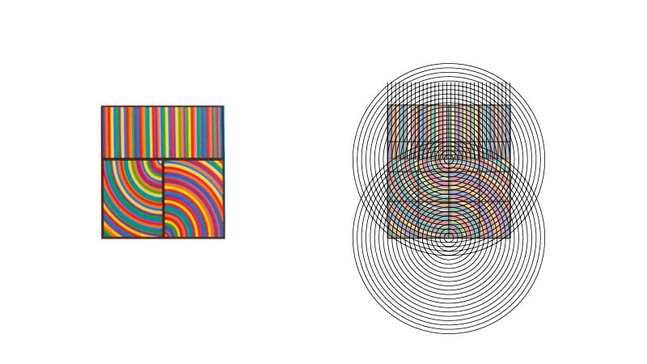

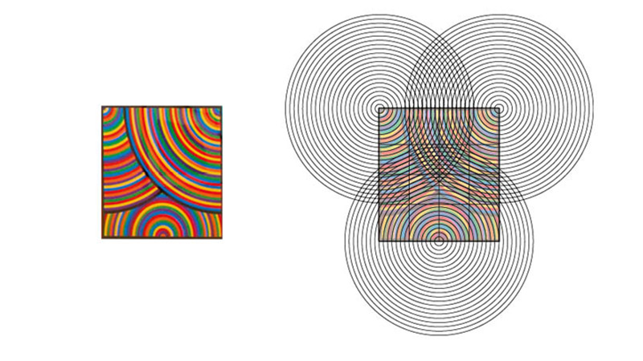

The artwork without the use of color is represented as an ordered grid calculated in every detail. Dividing the contour into its parts, it can be noted how each circle, or other basic illustrated geometric shapes, are positioned on the corner and intersect for creating an additional grid.

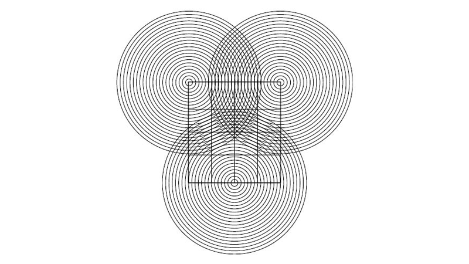

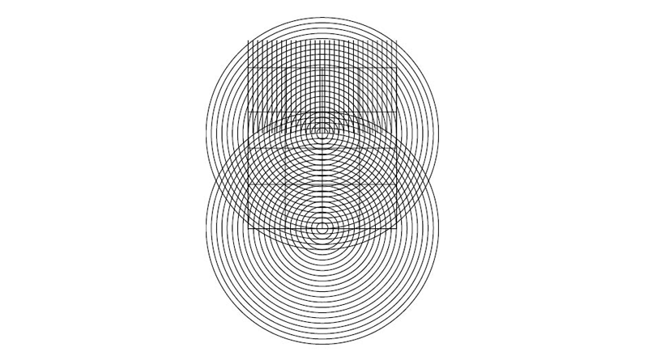

## Analyze: Color

The analyzed color in Sol LeWitt's work, keeps the same used standard as the repetition of the geometric form. The color used in his art work creates a mesmerizing vision for the viewer. Analyzing it is visible that the color used are mostly primary colors and the repetition are of the same diameter throughout the canvas. 
For a better comprehension, it was created a color palette with each color represented.

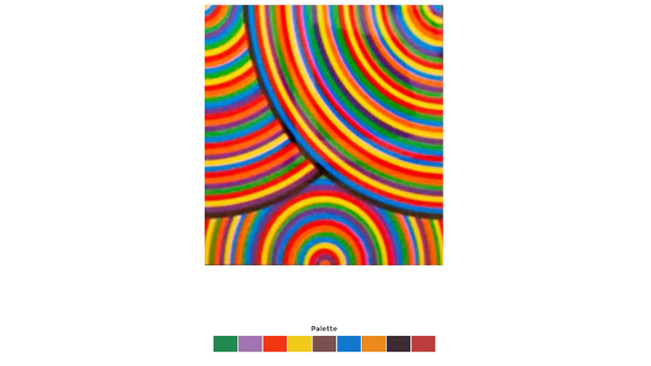

## Law of gestalt

We examined the series of works in connection with the Gestalt psychology. 

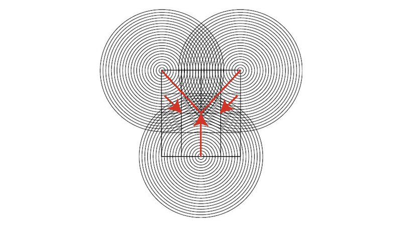

### Law of Good Continuation

We have a tendency to group and organize lines or curves that follow an established direction.

 

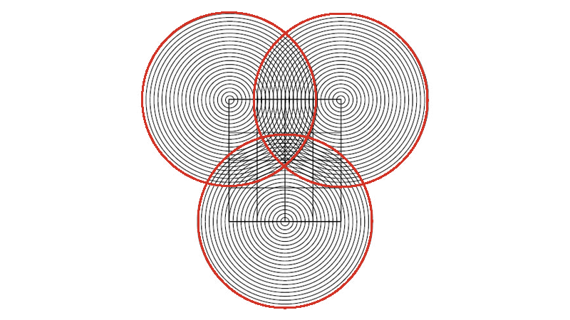

### Law of Prägnanz 

People will attempt to organize the image into the simplest form possible. 

## Sol LeWitt's art in P5.js 

After familiarizing with the work method and studys behind Sol LeWitt's art, it was time to practice his vision by coding it in P5.js. 

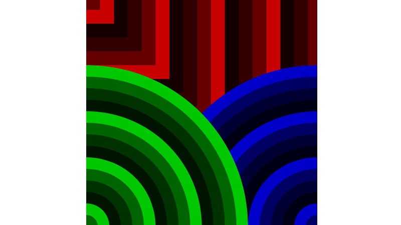

The artwork creates modulated shapes usign the same basic construct. Each geometry is composed of a loop which, throghout each iteration creates anested like structure. This structure uses a counter updated on each iteration to calculate the size, with basic arithmetic and the color, calculating
the index in an array of colors using the modulo operator, emulating a cycle.⁠⁠⁠⁠

You can take a look at the code [here.](https://interface.fh-potsdam.de/gestalten-in-code/color/geometric-shapes/)

## License (MIT)

(c) 2017 Daniele Maselli, Denys Ivanchenko, University of Applied Sciences Potsdam (Germany)

Permission is hereby granted, free of charge, to any person obtaining a copy of this software and associated documentation files (the "Software"), to deal in the Software without restriction, including without limitation the rights to use, copy, modify, merge, publish, distribute, sublicense, and/or sell copies of the Software, and to permit persons to whom the Software is furnished to do so, subject to the following conditions:
The above copyright notice and this permission notice shall be included in all copies or substantial portions of the Software.
THE SOFTWARE IS PROVIDED "AS IS", WITHOUT WARRANTY OF ANY KIND, EXPRESS OR IMPLIED, INCLUDING BUT NOT LIMITED TO THE WARRANTIES OF MERCHANTABILITY, FITNESS FOR A PARTICULAR PURPOSE AND NONINFRINGEMENT. IN NO EVENT SHALL THE AUTHORS OR COPYRIGHT HOLDERS BE LIABLE FOR ANY CLAIM, DAMAGES OR OTHER LIABILITY, WHETHER IN AN ACTION OF CONTRACT, TORT OR OTHERWISE, ARISING FROM, OUT OF OR IN CONNECTION WITH THE SOFTWARE OR THE USE OR OTHER DEALINGS IN THE SOFTWARE.

See also http://www.opensource.org/licenses/mit-license.php

