  

*The aim of this project was to create an analog algorithm, in which the human factor played an important role.*

## Search algorithm
​
Initially, it was necessary to create an analog algorithm, which was then supposed to be performed by at least 10 people. The first algorithm was taken from the example of bees. That's how they do their job of collecting honey. But already at the first stages of the algorithm, the idea of ​​an analog algorithm was revised. But later it was decided to adopt a completely different idea. At the heart of new ideas were solar prominences. They inspired them with an unusual structure, as they appear on the surface of the sun and, of course, their diversity, variety, and repeatability. At the first stage, there was an attempt to transfer the essence of prominences, their origin, and different locations. In this, at the first stage, the idea arose of any possible auxiliary means to create the desired result. But early results showed that only text is not enough. In this initial list of basic subjects, such as pen and paper. There were experiments, supplemented by liner, marker, and pencil. This version of the embodiment wanted to give a person freedom, and then a free and unpredictable appearance of the projections themselves, the number of constants was reduced to one. It was a constant size, did not say what size, but it was said that the dimensions were about the same.

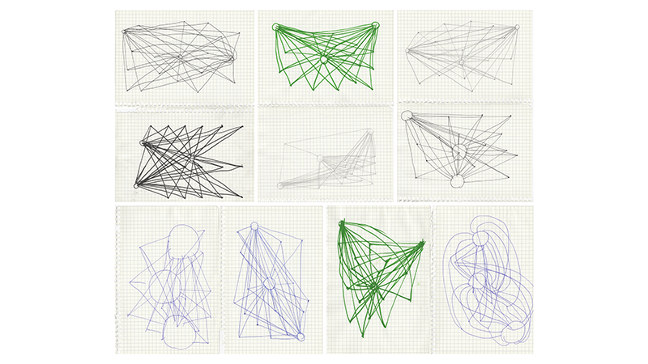

## The revised algorithm
​
​
Although the first test did not lead to the expected result. The results obtained are all exactly amazing, which shows how human evidence can be done.
The next step was to refine the algorithm to perform the algorithm of 10 people. But in this case, it was necessary to add a variation of the parameters for an individual parameter. On the first two results, it was decided to change the algorithm. Since at this stage we did not want to change the structure and appearance of the prominences, the parameter was changed. The size of the repetition, the specific size or the total freedom of choice of size. But the first two results made it clear that it is necessary to revise the algorithm. And it was decided to try to pass by themselves, are not the spontaneous appearance of prominences and their variety on the surface of the sun. Because the algorithm gave an interesting result, but it was far from the actual attention.
Accordingly, it was necessary to revise the idea of ​​more thoroughly studying the prominences themselves.
The new search was inspired by the very structure of prominences.
On paper, it was just a circle and a line. And thus it was difficult to give them unusual, since in this case when the circle is the sun of the line (prominences), it must be inside.
In this embodiment, the parameters burned them directly to draw not only a prominence outside the circle but also inside. Hence the parameters that had not only the size of the circles themselves but also the direction of the lines. And it was also added at will, that would change the thickness of the line (prominence). Thus, it is achieved that the attempt is inherent in the requirements of structural prominences.
Materials in this version have also been changed. To achieve more realistic results, it was decided to change the ordinary paper to black. Black represents the cosmos. But from the available drawing options on black and colored pencils, there were colored pencils, pencils were chosen warm colors that correspond to reality.  
The results were not bad and were close to the expected result.  
The algorithm is given that it is necessary. These prominences turned out to be similar to the present. But, unfortunately, the structure itself, the color gradient and the force that is visible in the prominences, the result is not shown. It's about the materials.  

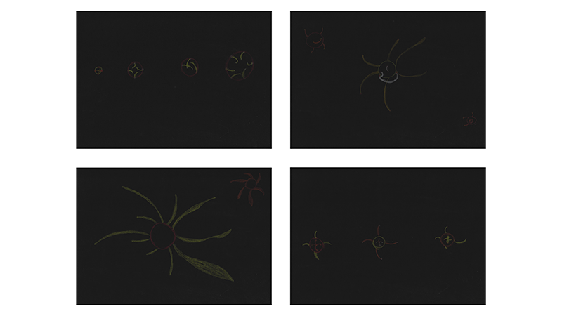
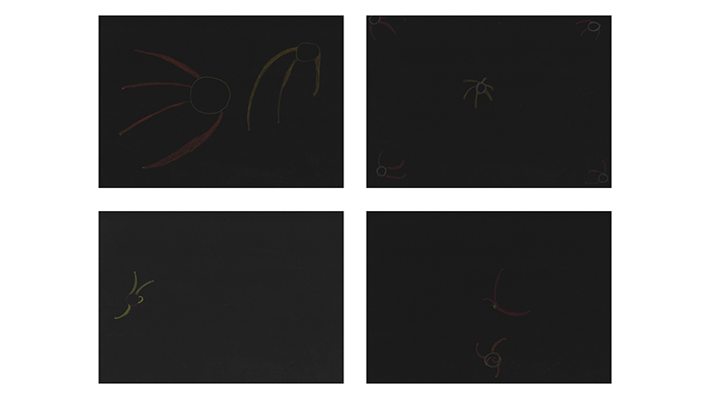

## Search materials

Whatever was achieved in a more realistic result, many kinds of colors and materials were tested.  
In the end, the choice was stopped on blue watercolors and plain white office paper. Below is an explanation of why such colors were chosen.
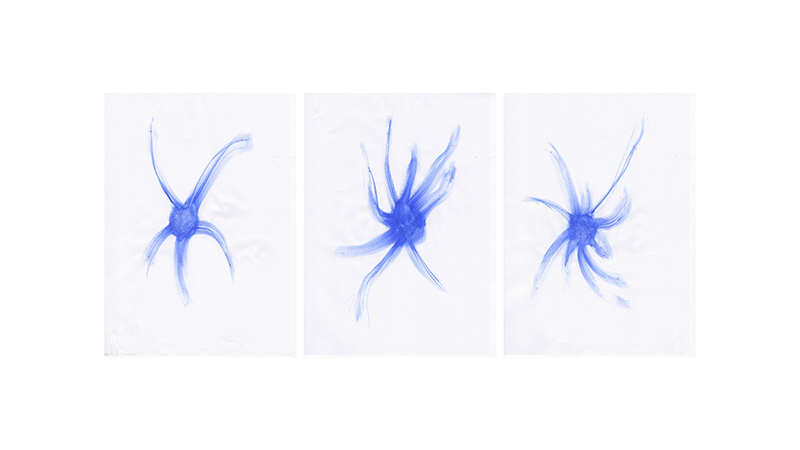

​
The result was unexpected and showed what was needed.
Unfortunately, there were no acceptable colors that could be drawn on black paper.
For this, white paper and blue watercolor were chosen.
Of course, the sun with blue projections can actually be observed, it is necessary to use an ultraviolet filter.
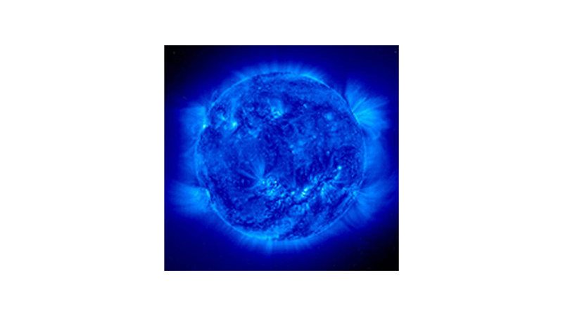

*Source: [www.astronoo.com](http://www.astronoo.com/images/soleil/soleil-protuberance-spicule_medium.jpg)*

​
But with minimal interference from Photoshop, namely the command "ctrl + i" that inverts the colors. It turned out that he had achieved the desired result. 
The results obtained can approximate real prominences.  

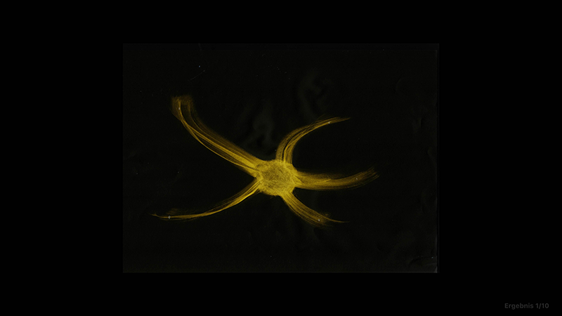
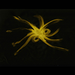
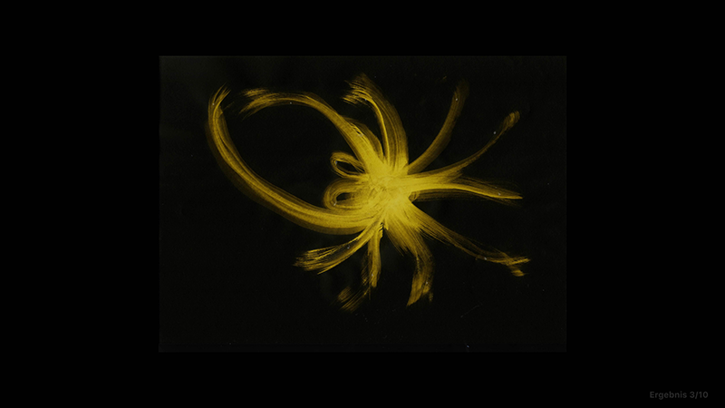
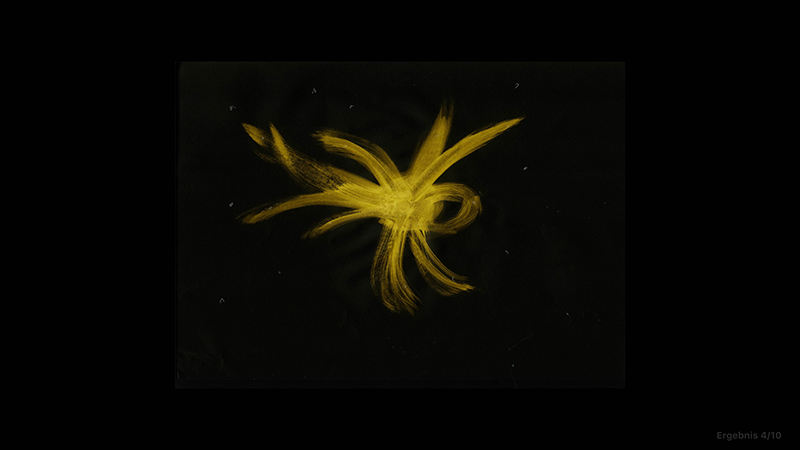
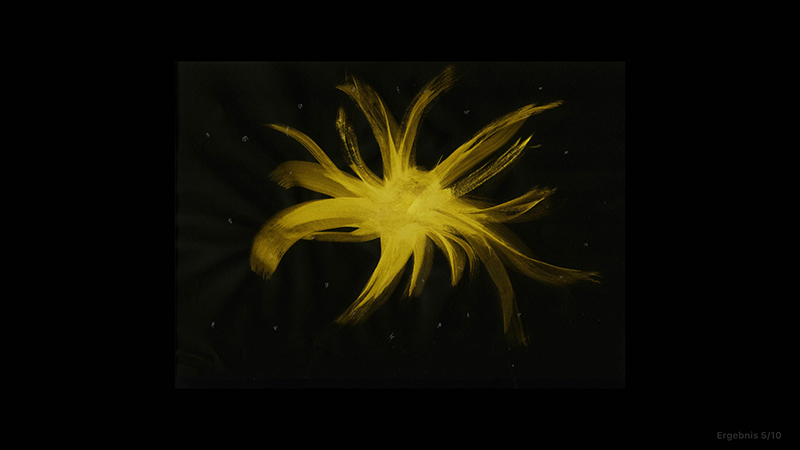
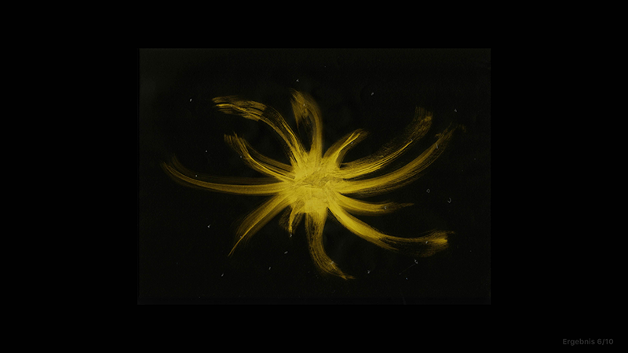
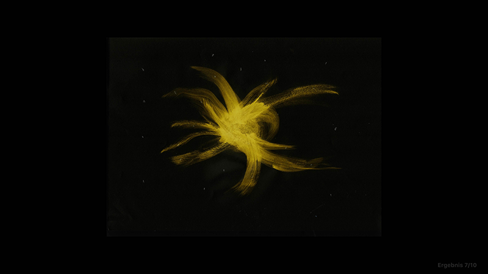
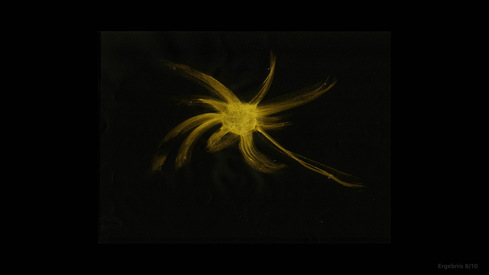
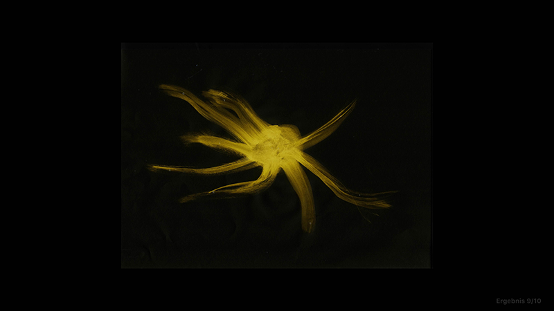
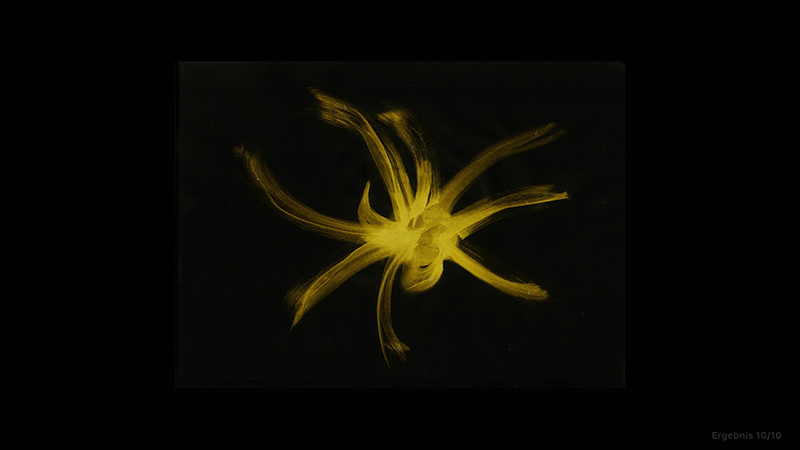
