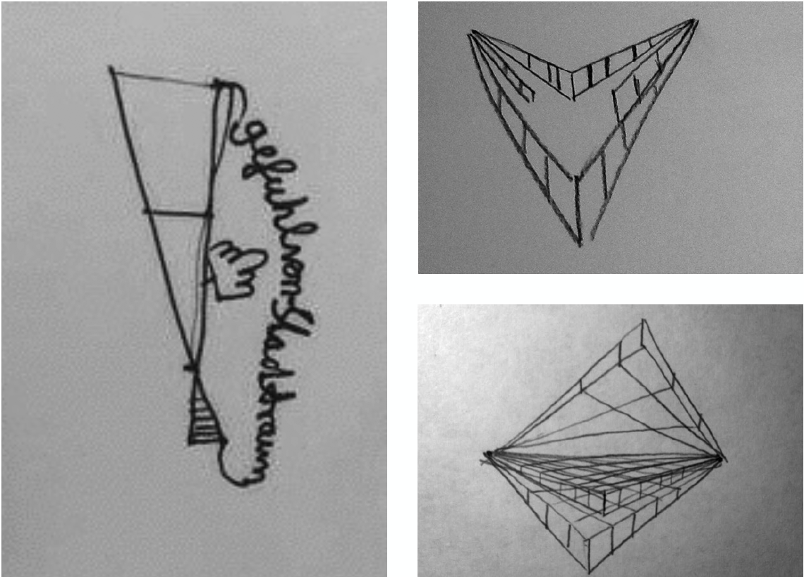
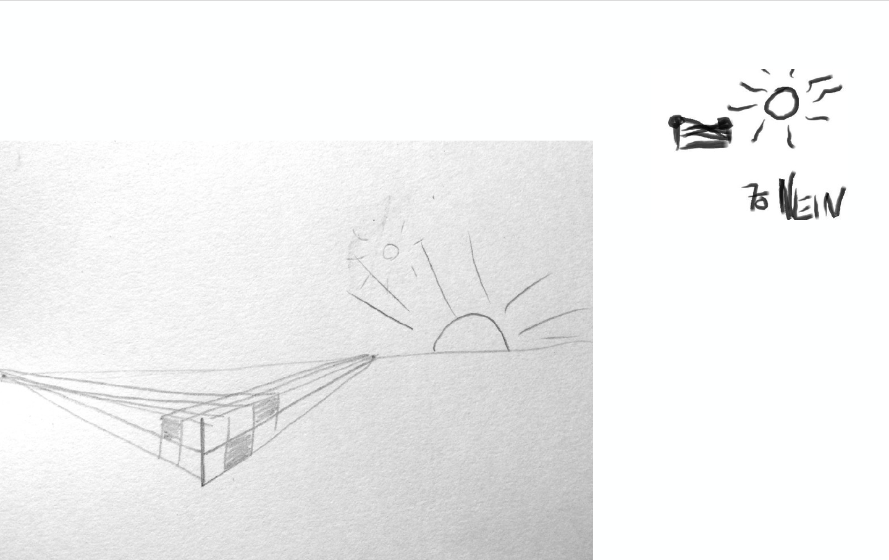
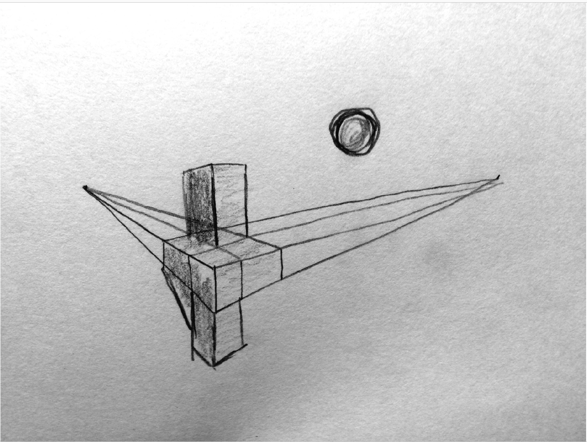
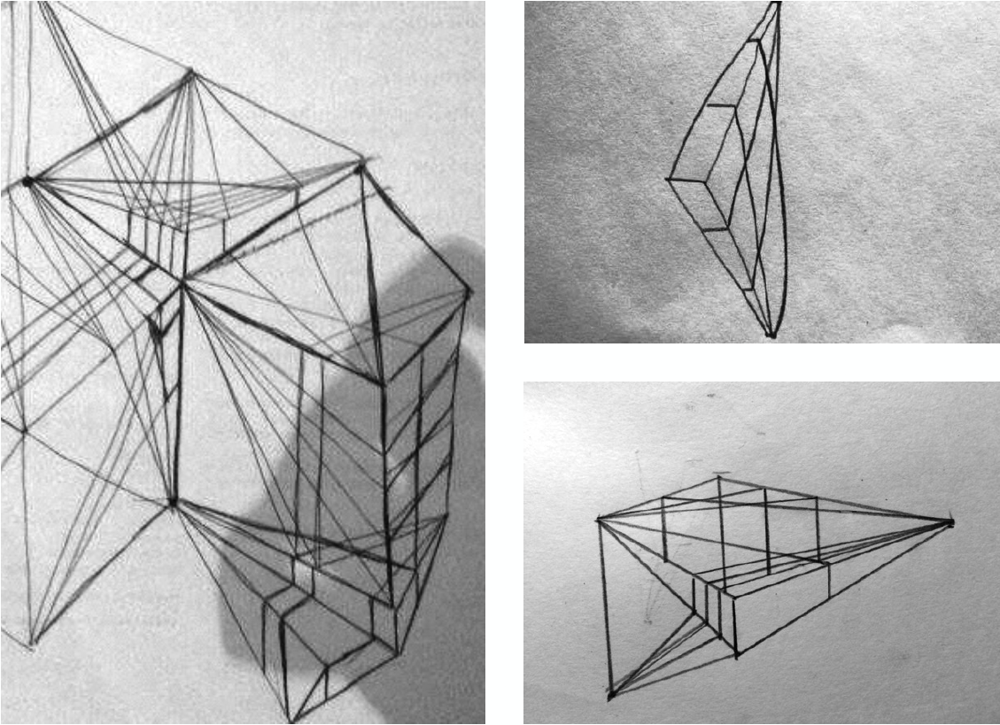
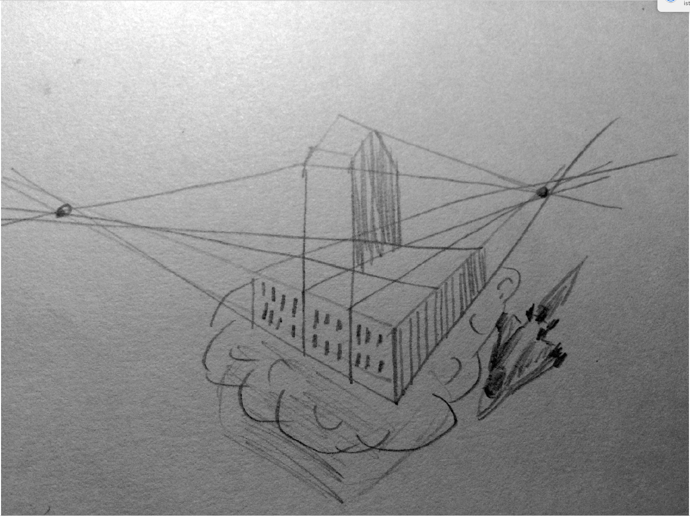
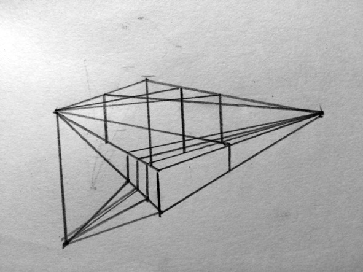

---
authors:
  - Theodor Hillmann
authors-url:
  - "http://theodorhillmann.de"
layout: project
type: project
---

# Synthetic Babylon
## analogue generative architecture

This work is part of a class at the University of Applied Sciences Potsdam. The project engages in analogue generative design. Initially an analogue algorithm has been written. I tried to generate architectural sketches inspired by Constant's "New Babylon". This initially analog algorithm has been extended and developed over many iterations and finally put in form.

For the algorithms first iteration pencils and sheets of paper were handed to 5 people. They were instructed to consequently follow the rules of the algorithm listed below. The following "code" is kept in written-german to stay closest to the original experience.

### Iteration 1:

> Work the following points one at a time.
> Use a blank sheet of paper and a pencil (if possible).

> 1. Draw two points that are horizontal, and are not farther away than a finger is long.
> 2. Draw below, between these points, a vertical, hardly more than a fingernail is wide.
> 3. Connect the ends of the vertical to the two points through straight lines.
> 4. Draw any number of verticals between them obliques.
> 5. Connect the resulting upper contact points to the bevels with the not yet connected point.
> 6. Continue this technique until a sense of urban space arises
>
> Thanks!

The results turned out to be rough and did not fulfil the visual expectations.
Therefore in the following steps the algorithm has continuously been adjusted.

### Iteration 2:

> Work the following points one at a time.
> Use a blank sheet of paper and a pencil (if possible).
>
> 1. Draw two points that are horizontal, and are not farther away than a finger is long.
> 2. Draw below, between these points, a vertical, hardly longer than a fingernail is wide.
> 3. Connect the ends of the vertical to the two points through straight lines.
> 4. Draw any number of verticals between them obliques.
> 5. Connect the resulting upper contact points to the bevels with the not yet connected point.
> 6. The sun is rising in the east.
> 7. Are you satisfied with the result? What could be added?
>
> Thanks!

This text was handed to 10 people.

For the final iteration the algorithm was adjusted to achieve a richer picture.

### Iteration 3/4/5:

> Work the following points one at a time.
> Use a blank sheet of paper and a pencil (if possible).
>
> 1. Draw two points that are horizontal to each other, and are not more distant than a finger long.
> 2. Draw below - between these points a vertical, hardly more than a fingernail.
> 3. Connect the ends of the vertical with the two points by straight lines.
> 4. Draw any number of verticals between these slopes.
> 5. Connect the resulting upper contact points on the slopes to the opposite point from (1) which is not yet connected.
> 6. Continue this technique by drawing more bevels, uprights, and perhaps even points. Can you create a floating city?
>
> Thanks!

The picture underneath is my favorite one and it is closest to what I tried to achieve. It was a good exercise to get a basic understanding of how to write understandable code and opened up my perspective of thought towards a more linguistic future ahead. Will Human Machine communication be more focussed on our habits or on the languages machines are already developing independently?

