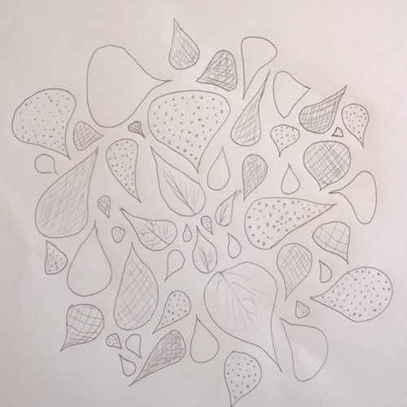

--- 
authors: - "Jeanette Knipp"
authors-url:   - "https://github.com/lellahahaha"
layout: project
title: "This is not a Leaf"
type: project
---

# This is not a Leaf
## Creating an Algorithm

 

To understand how algorithms work, it’s best to create one yourself. This way you get to figure out essential components: you discover what stays constant and what is variable, you understand which elements you need to change or even eliminate to get different results - to get as close to your desired outcome as possible.

----------

### The First Algorithm

1. *Draw a great square in the center of your sheet of paper.*
1. *Devide this square into four equally sized, smaller squares using one horizontal and one vertical line.*
1. *Write down one word in each square. (verb, noun or adjective)*
1. *Draw your associations concerning those words outside around the big square.*1. *Sign your creation.*

 

---------

This first examplary task has been fullfilled correctly in almost all of the four cases. It has many constants and few, clear variables. But what made one person write down words outside of the square instead of drawing associations? It’s called inattention. A capricious factor when creating an algorithm. Because no matter how precise you are with your phrasing, if your subjects are not concentrating, the task may have way different results than expected. But now that the basics have been explained, let’s hop to the second attempt…

----------

### The Second Algorithm

*Draw leaf-like forms (ovals that thin to the tails).*

1. *Crisscross, in different sizes, as close as possible whilst still not touching!*
1. *Fill some of them with hatchures, others with tiny dots and leave others empty.*

*You do not have to fill the entire sheet!*

In this case, the only constant is the shape oft he objects. Variables are the sheet format, the colour oft he chosen pencil, the number of drawed shapes, their exact location on the sheet, their exact size and, conditionally, the filling of each shape. As you will learn, to get your algorithm to be unmistakable it should be the other way around: the constants should predominate, the variables should be fewer and more precise:

1The results show that this instruction often persuades subjects to draw entire leafs instead of the described leaf-like shapes.
Therefore, another approach is to change the first sentence like this:

*Draw ovals that thin to the tails.*

This eliminates the thought of leafs from the subjects‘ mind and lets him focus on the described form.

But still, people tend to draw the shapes comparative widely spread from each other. Hence, the first point in the instruction has to be changed - for example like this:

*crisscross, in different sizes, almost touching.*

Now, the subjects do not focus on the shapes not touching but rather on them being drawn closely.

Also, the filling of the shapes has often been neither dotted, nor hatched, nor let empty. But in this case it’s important to focus on what you want as outcome. Do you really want the results to be all the same?
Nah.
So the second point has to be changed:

*Fill some of them with lines or dots and leave others empty.*

This way you get a wider range of possible correct outcomes while increasing the space for creativity.

----------

### The Revised Second Algorithm

The revised algorithm now looks like this:

*Draw ovals that thin to the tails. crisscross, in different sizes, almost touching. Fill some of them with lines or dots and leave others empty.*

Since the algorithm is nearly unambiguous now that we have eliminated some variables and rephrased the instruction more detailed, it’s time mess around with the constants!

### Changing Constants

How about changing the leaf-like shapes to clouds, hearts and stars?

As you can see, with this new algorithm it still works out. All correct results! But a little corny now. So let’s stay with the pseudo-leafs and change the canvas! No regular sheets of paper allowed anymore. But instead - wrapping paper, an egg, even skin.

The outcomes are interesting but still „only“ art. So let’s try to make something useful. Lanterns for example?

Nice try, but unfortunately it does not look that professional after all. So what about painting on shirts, envelopes, glass, porcellain?

Yassss!

This has been a journy through creating a flawed algorithm and analyzing, changing and defining it until it’s become faultless. It took a lot of time to get to really understand its functionality but in the end this knowledge could be used like a creative weapon.
In the end there was SUCCESS!
