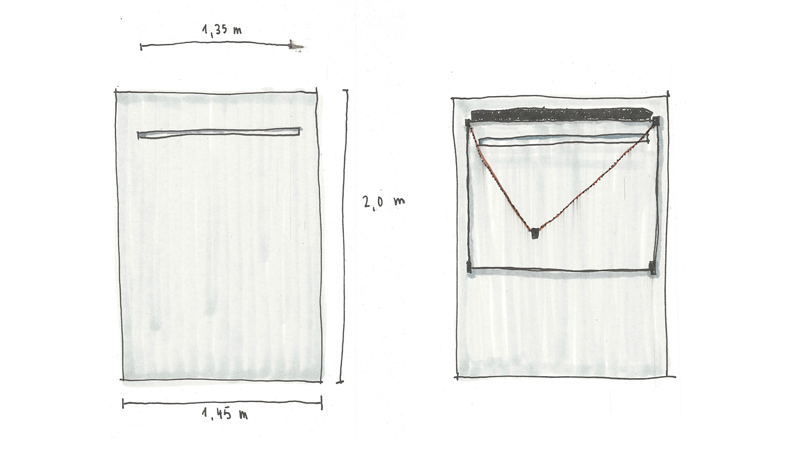
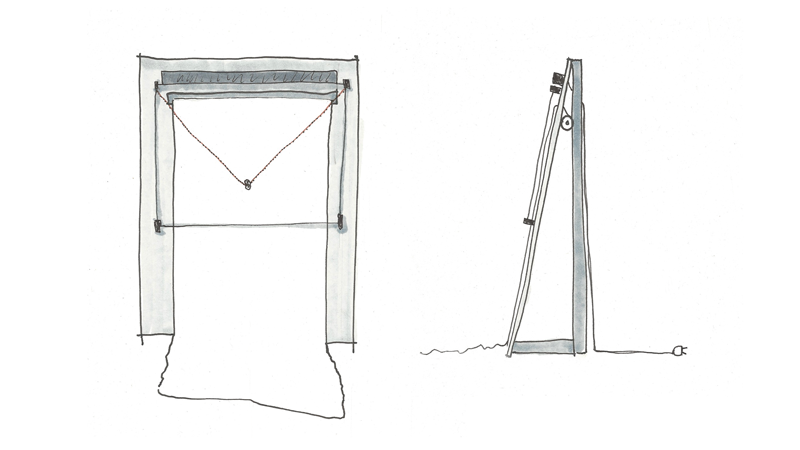
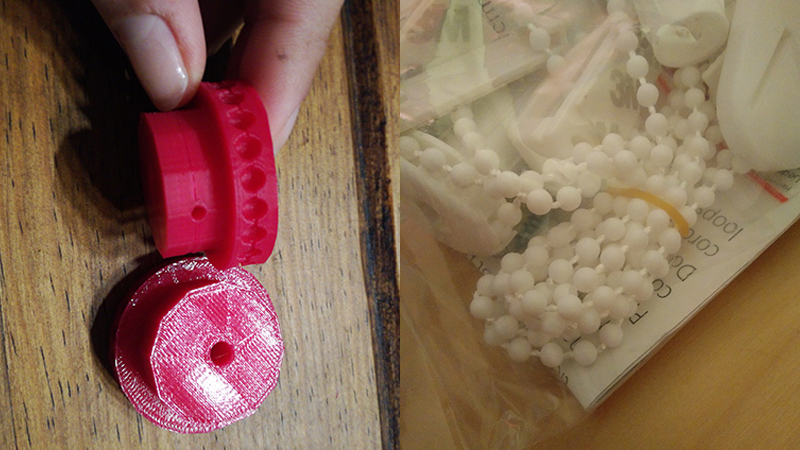

# Working title and a fancy claim!
**[Splash image or video]**

## Introduction
You will find a quick introduction to the topic here as soon as the project is finished.

## Tech specs
The _artomaton_ is a custom-made polagraph with a paper feed and various electronics. It consists of the following elements:
*   ...
*   ...
*   ...

## Design
**[Splash image]**

The _artomaton_ is made from a MDF panel that serves as surface for the drawing area. A custom-made polagraph gives us the possibility to draw on the paper roll mounted on the backside of the _artomaton_.  

## How it works
A step-by-step description on how the machine works.

1.  ...
2.  ...
3.  ...

## The process
### Assignment
Our assignment was to build and develop a machine that creates art – an artomaton. Particularly on the basis of Gestalt psychology and the laws of Gestalt. We needed to specify input and output, additionally the functional principle needs to include at least three laws of Gestalt.
Four groups were formed to pitch the best project and after many hours of brainstorming, discussing, refining and evaluating we came up with the following idea.

### Initial idea
Inspired by the visuality of Tim Rieckes work [»con\texture\de\structure«](https://www.youtube.com/watch?v=uRK3V207iSk) we wanted to build a plotter that traces the visitors movements in space using an exhibition context. It was our goal to visualize parts of our own reality, which are normally hidden und unnoticed to stimulate the relation between visitors and space. To make the speed of movement visible the movement is observed in time and space. For this reason we use exhibits to catch the visitors attention and control their speed of movement on a scale from passing by quickly to completely standing still.
By chancing the exhibits positions and the art of placement (on walls, in space, etc.) we create a new output every time. The exhibits could actually be called parameters to shape the visitors movement in space.

### Visualizing movement and interaction
**[Splash image]**

Searching for a design vocabulary idiom we came up with the idea of using geometric shapes as signals for standstill and finding relations between single movements. To keep things simple we decided set the lines dynamic in exponential relation to the speed of movement: The calmer the movement is the less dynamic is the line drawn.

**[Image with additional scribbles]**

Additionally to the relation between visitors and space, it's also possible to show the interaction and relation of people themselves and how the influence their movements in space.

If visitors are moving in a fast way through the room, the line stays straight. If they move slow, the line gets curvy. As soon as visitors get closer than 50 cm the space between their lines gets crosshatched.

**[Image with additional scribbles]**

When they start to separate the hatching stops. Relations tend to form by slow movement in space because the curvy lines get closer to each other.

If visitors stand face to face close to each other their lines merge. If there's a distance between them their line bridge space.

### Construction concept

The _artomaton_ is based on a MDF panel sized 145 x 200 cm with a 135 cm wide slot in the upper range. The plotters frame is assembled with a distance of 5cm on all three sides.

We conduct paper through the slot from an ongoing paper roll, so that print area lays flat on the base area. The panel won't be installed vertically on the floor, but rather slightly bent to grant a more exact control of the pen. This also gives us quick access to wiring and paper feeding on the backside of the plotter. In order to achieve these benefits it's necessary to design an additional supporting structure.

### Building the plotter
Already in an early stage we decided not to use a horizontal xy-plotter but a polagraph, which is a vertical plotter. We used these [instructions](http://www.makerblog.at/2014/09/vertikalplotter-im-selbstbau-teil-1-polargraph-kritzler-makelangelo-und-co/) as reference and guideline.

While one team went shopping to get a ball chain and other needed supplies, the 3d printing team manufactured the separate components.

### Mounting the MDF construction
**[Image of hard working students in the wood workshop]**  
Work in progress

### Arduino brings the plotter to life  
Work in progress

### First test run  
Work in progress

## Software
All about code: Build process, code structure and what else needs to be said.

## Hardware
All about hardware: How was it build? Plus used components, circuit diagram and so on.

______________
_The italic parts will be replaced with the actual project name_
